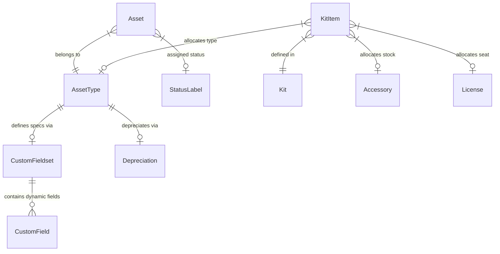

<p align="center">
  
</p>

<h1 align="center">AssetBox</h1>

<p align="center">
  <strong>IT Asset Management (ITAM) platform built on Django, Tabler, and HTMX</strong>
</p>

<p align="center">
  <a href="https://www.python.org/"></a>
  <a href="https://www.djangoproject.com/"></a>
  <a href="https://htmx.org/"></a>
  <a href="https://tabler.io/"></a>
  <a href="https://github.com/netbox-community/netbox"></a>
  <a href="https://opensource.org/licenses/Apache-2.0"></a>
</p>

AssetBox is an IT asset management (ITAM) and tracking application. Inspired by the strict data modeling approach of **NetBox**, it is designed as a lightweight, customizable inventory tool for hardware, software licenses, maintenance history, and asset financials.

---

## Key Features

*   **Dynamic Custom Fieldsets:** Add custom metadata fields (text, number, date, boolean, dropdowns) to specific `AssetTypes` on the fly. Data is stored in a `JSONField` on the `Asset` model, removing the need for database schema migrations.
*   **Maintenance & TCO Ledger:** Logs support events, upgrades, and repair costs. Calculates asset downtime automatically and aggregates initial cost with maintenance records to compute a true Total Cost of Ownership (TCO).
*   **Symmetric Encryption at Rest:** Protects software product keys and credentials in the database using standard `AES-256 Fernet` cryptography (keys derived from Django's `SECRET_KEY`). Includes a transparent fallback header (`enc$`) for backward-compatibility with plaintext values.
*   **Valuation & Straight-Line Depreciation:** Computes real-time book value using purchase cost, customized lifespans, and salvage values, complete with visual progress metrics.
*   **Onboarding Kits:** Group multiple hardware types, accessories, and software seats into pre-defined kits. Checkout runs inside an atomic transaction block, rolling back entirely if any kit item is out of stock.
*   **Responsive HTMX-based UI:** Page navigation, search filters, and active tab lists update instantly without full page reloads, using simple HTML-swaps and Out-of-Band (OOB) triggers.

---

## Tech Stack

*   **Backend:** Django 5.2, Python 3.11+, Django REST Framework (DRF)
*   **Frontend:** Tabler CSS (Bootstrap 5), HTMX, django-htmx, django-template-partials
*   **Database:** SQLite (default/development) / PostgreSQL (production support)
*   **Core Libraries:** django-tables2 (interactive grids), django-filter (filtering panels), django-crispy-forms (crispy form renderers), cryptography (symmetric AES-256)

---

## System Architecture

### Entity Relationship Diagram



### HTMX Navigation

AssetBox uses a dual-template layout to achieve a fast interface without a complex JavaScript frontend framework:
1.  **Full Request:** Renders the outer shell (`base.html`) containing the sidebar, top navigation, and dependencies.
2.  **HTMX Request:** Dynamically swaps out the `#page-content-wrapper` block using a partial template (`base_htmx.html`), updating the active breadcrumbs, actions, tables, and tabs in a single roundtrip.
3.  **Out-of-Band (OOB) Swaps:** Modifies peripheral elements like `<title>` tags and toast notifications on demand.

---

## Getting Started

### Quick Start with Docker Compose

To spin up the PostgreSQL database and application server immediately:

```bash
# Clone the repository
git clone https://github.com/assetbox-itam/assetbox-webapp.git
cd assetbox-webapp

# Build and start services
docker compose up -d --build

# Run database migrations
docker compose exec app python manage.py migrate

# Seed sample data (creates initial organization, assets, and users)
docker compose exec app python manage.py seed_data

# App is now live at http://localhost:8000 (Default login: admin / admin)
```

### Local Virtualenv Setup

```bash
# Set up virtual environment
python3 -m venv .venv
source .venv/bin/activate  # On Windows: .venv\Scripts\activate

# Install dependencies
pip install -r requirements.txt

# Configure database and default records
cd assetbox
python manage.py migrate
python manage.py seed_data

# Start local server in debug mode
ASSETBOX_DEBUG=true python manage.py runserver

# App is now live at http://127.0.0.1:8000
```

---

## Running Tests

Automated unit and integration tests cover model signals, validation constraints, FilterSets, and CRUD APIs:

```bash
# Run all tests
python manage.py test

# Test specific applications
python manage.py test assets
python manage.py test subscriptions
python manage.py test core
```

---

## License

This project is licensed under the Apache License 2.0.
