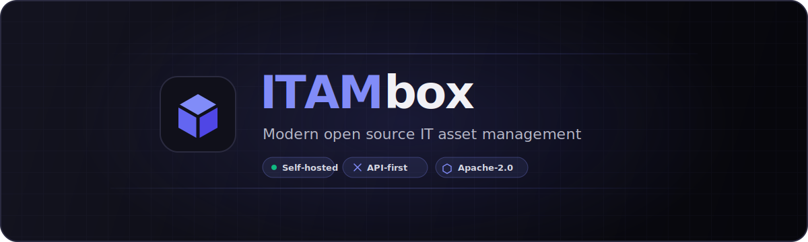

<p align="center">
  <a href="https://itambox.dev">
    
  </a>
</p>

<p align="center">
  <strong>Self-hosted IT asset management for hardware, software, custody, procurement, and compliance.</strong>
</p>

<p align="center">
  <a href="https://itambox.dev">Website</a>
  · <a href="itambox/docs/index.md">Documentation</a>
  · <a href="CHANGELOG.md">Changelog</a>
  · <a href="CONTRIBUTING.md">Contributing</a>
  · <a href="SECURITY.md">Security</a>
</p>

<p align="center">
  <a href="LICENSE"></a>
  
  
  
</p>

ITAMbox gives internal IT teams and managed service providers one tenant-aware system for assets, stock, software, licenses, subscriptions, procurement, custody, and audits. REST/OpenAPI covers tenant-scoped application resources; the built-in GraphQL schema covers assets, software, licenses, inventory, and subscriptions, with extension points for plugins.

> [!IMPORTANT]
> This repository is pre-release. `1.0.0-alpha1` is current version metadata, not a published tag or supported release line. APIs, migrations, routes, and configuration may change before the first release. Use a disposable environment for evaluation and do not assume upgrade or support guarantees until a release is tagged.

## What ITAMbox covers

| Area | Included workflows |
|---|---|
| Asset lifecycle | Hardware catalogues, assignments, check-in and check-out, reservations, warranties, maintenance, depreciation, disposal, and total cost tracking |
| Inventory and stock | Accessories, consumables, components, kits, location-level stock, barcode and QR scanning, and bulk operations |
| Software and licenses | Installed-software records, license-seat assignment, suppliers, cost centers, and software catalogue management |
| Subscriptions and procurement — Beta | SaaS subscriptions, purchase orders and lines, contracts, fulfillment links, and asset-request workflows |
| Governance | Tenant and tenant-group scoping, role-based access, delegated resource grants, custody receipts, audit campaigns, change history, retention, and recycle-bin workflows |
| Customization | Custom fields, tags, imports and exports, labels, saved filters, attachments, and journals |
| Reporting and automation — Beta | Dashboards, reports, alerts, notification channels, event rules, webhooks, and background jobs |
| Identity and integrations | LDAP, SAML, OIDC, TOTP for privileged local accounts, Intune discovery, REST/OpenAPI, and scoped GraphQL; SCIM and plugins are Beta |

See [module maturity](itambox/docs/development/module-maturity.md) for the current Stable and Beta designations. SCIM is Beta: tenant endpoints provision Users and expose Groups read-only, while provider-scoped endpoints provision both Users and provider-owned Groups.

## Architecture

- Django 5.2 with Python 3.12 as the currently qualified interpreter (`>=3.12` metadata minimum)
- PostgreSQL 15 or newer; SQLite is intentionally unsupported
- Server-rendered Tabler UI with HTMX, TypeScript, and SCSS
- Django REST Framework with OpenAPI, Swagger UI, and ReDoc
- Graphene-Django for the scoped GraphQL schema
- django-q2 workers using the PostgreSQL ORM broker; Valkey or Redis provides shared production cache, rate-limit state, and SAML replay protection
- MkDocs for operator, integration, model, and developer documentation

Start with [DEVELOPMENT.md](DEVELOPMENT.md) for implementation conventions.

## Evaluate from source

The documented evaluation path uses development settings. Use the currently qualified Python 3.12 interpreter, Node.js 20, and PostgreSQL 15 or newer. Use a fresh database and a PostgreSQL role that can create test databases and install the `btree_gist` extension.

```bash
git clone https://github.com/itambox/itambox-webapp.git
cd itambox-webapp
python -m venv .venv
source .venv/bin/activate               # Windows Git Bash: source .venv/Scripts/activate
python -m pip install -r requirements-dev.txt
cp .env.example .env                    # PowerShell: Copy-Item .env.example .env
```

Set `ITAMBOX_ENV=dev` and the `ITAMBOX_DB_*` values in `.env`, then build the frontend and initialize the application:

```bash
cd itambox
npm ci
npm run build:all
python manage.py migrate
python manage.py seed_data --skip-drop
python manage.py runserver
```

Open <http://127.0.0.1:8000> and sign in as `lars.eklund` with the demo password `itambox2026`. The seed contains public credentials and sample organizations; keep it local and use it only with a disposable evaluation database. `--skip-drop` prevents the command from clearing existing records, but it still creates and updates demo data.

See [CONTRIBUTING.md](CONTRIBUTING.md) for platform-specific activation commands, database setup, test prerequisites, and the complete quality gates.

## Production deployment with Docker Compose

The included Compose stack builds the application and worker from source and runs them with PostgreSQL 16 and Valkey 8. It enforces production settings and expects HTTPS termination at a reverse proxy; direct browser access to the published HTTP port is not a supported deployment path.

```bash
cp .env.example .env
# Configure production secrets, database credentials, hosts, CSRF origins,
# SMTP, and the external HTTPS URL before continuing.

docker compose build
docker compose run --rm app python manage.py migrate
docker compose run --rm app python manage.py createsuperuser
```

Configure the reverse proxy, TLS, and port restriction before starting the long-running services, then start the stack:

```bash
docker compose up -d
```

Back up PostgreSQL, uploaded media, `ITAMBOX_SECRET_KEY`, `ITAMBOX_FIELD_ENCRYPTION_KEYS`, and `ITAMBOX_API_TOKEN_PEPPERS` together. Follow the [installation guide](itambox/docs/operations/installation.md), [backup and restore guide](itambox/docs/operations/backup-restore.md), and [upgrade guide](itambox/docs/operations/upgrades.md).

> [!NOTE]
> ITAMbox does not publish a Python package or prebuilt container image. `pyproject.toml` supplies project metadata only; the documented install paths use the repository's source checkout or a locally built Docker image.

## Development and verification

The canonical contributor environment uses Python 3.12 in CI, PostgreSQL 16, and Node.js 20. Typical full gates are:

```bash
# Repository root
pre-commit run --all-files
python scripts/check_flake8_baseline.py

# itambox/
python manage.py makemigrations --check --dry-run
python manage.py check
pytest --cov=. --cov-report=term --cov-fail-under=45
npm ci
npm run build:all
npm run typecheck
npx eslint static/src
```

The full pytest suite is not xdist-safe; run it serially. [CONTRIBUTING.md](CONTRIBUTING.md) documents change-specific checks, Playwright prerequisites, and the isolated production smoke test.

## Documentation

The repository includes operator, integration, model, plugin, and development guides under [`itambox/docs/`](itambox/docs/index.md). MkDocs is installed separately from the application development requirements:

```bash
python -m pip install mkdocs mkdocs-material
cd itambox
mkdocs serve
```

Useful starting points:

- [Installation](itambox/docs/operations/installation.md)
- [Backup and restore](itambox/docs/operations/backup-restore.md)
- [Upgrades](itambox/docs/operations/upgrades.md)
- [Bulk import](itambox/docs/integration/bulk_import_guide.md)
- [SCIM provisioning](itambox/docs/integration/scim.md)
- [REST and GraphQL integration](itambox/docs/integration/developer_guide.md)
- [Plugin development](itambox/docs/plugins/getting_started.md)

## Security

Do not report vulnerabilities in a public issue. Follow [SECURITY.md](SECURITY.md) and contact [security@itambox.dev](mailto:security@itambox.dev) privately.

## License

ITAMbox is licensed under the [Apache License 2.0](LICENSE). Third-party attribution is recorded in [NOTICE](NOTICE).
