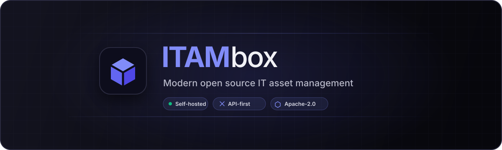
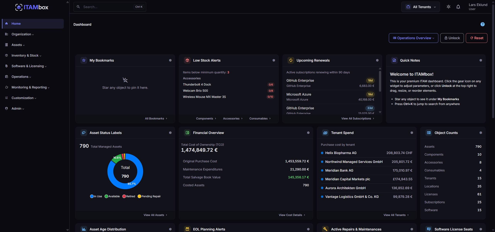
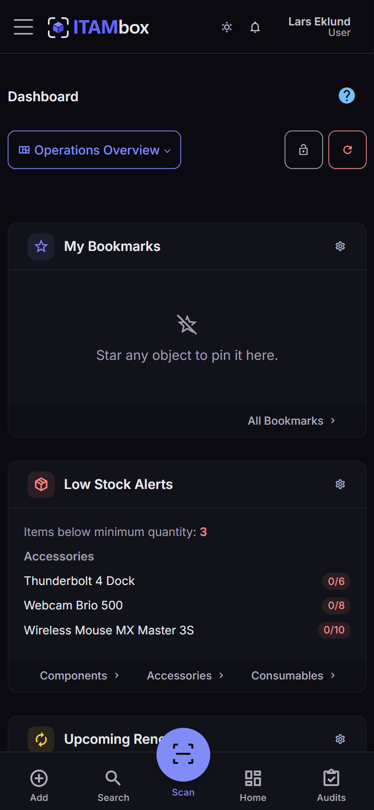
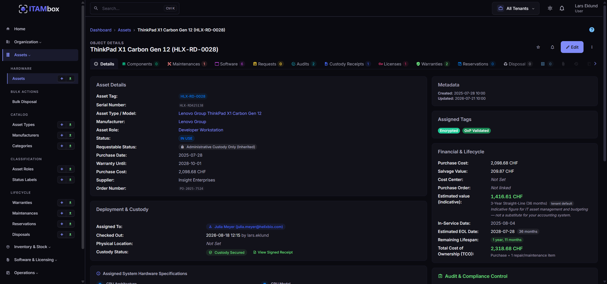
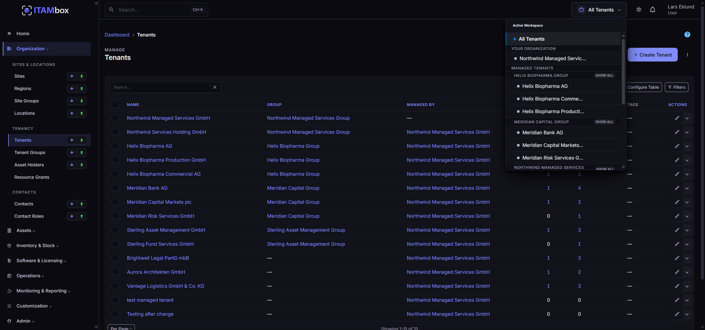
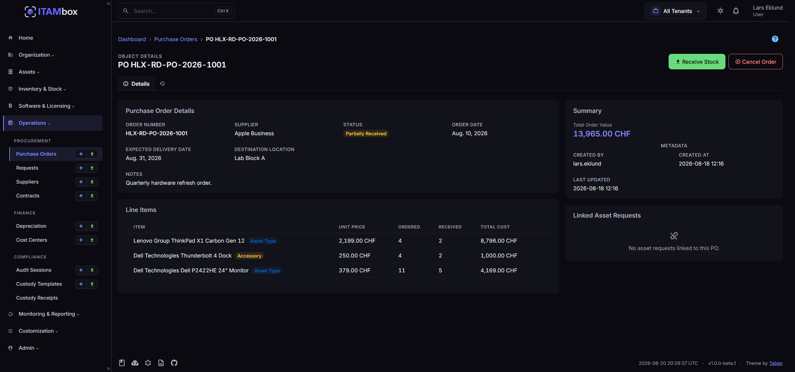
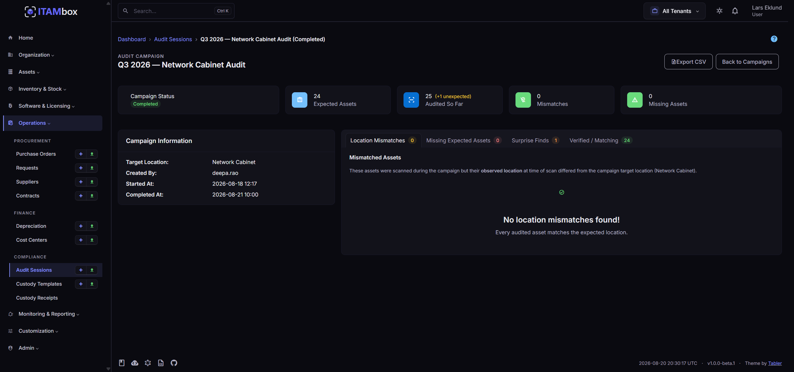

  

  <strong>The operational system of record for IT assets, from request to retirement.</strong> 
  Open-source, self-hosted IT asset management for internal IT teams and managed service providers.

  <a href="https://itambox.dev">Website</a>
  · <a href="https://demo.itambox.dev">Live demo</a>
  · <a href="itambox/docs/index.md">Documentation</a>
  · <a href="CHANGELOG.md">Changelog</a>
  · <a href="CONTRIBUTING.md">Contributing</a>
  · <a href="SECURITY.md">Security</a>

  
  
  
  
  

ITAMbox gives IT teams one operational history for the assets they manage and the decisions made around them. Instead of separating asset records, stock, software, licensing, procurement, custody, compliance, and disposal across disconnected tools and spreadsheets, ITAMbox connects them in one tenant-aware system.

Built for both internal IT departments and MSPs, ITAMbox combines a broad asset-management data model with operational workflows, explicit authorization boundaries, auditability, and programmable integration surfaces.

  <a href="#itamboxs-role">ITAMbox's Role</a> |
  <a href="#why-itambox">Why ITAMbox?</a> |
  <a href="#try-the-live-demo">Live Demo</a> |
  <a href="#getting-started">Getting Started</a> |
  <a href="#integrations-and-extensibility">Integrations</a> |
  <a href="#screenshots">Screenshots</a>

  

  <strong>Mobile dashboard</strong> 
  

## ITAMbox's Role

ITAMbox serves as the operational system of record for IT assets and the decisions around them. It records what exists, where it is, who is responsible for it, how it was acquired, what it costs, which software, licenses, subscriptions, suppliers, and contracts relate to it, and what happened throughout its lifecycle.

ITAMbox does **not** try to replace endpoint management, remote monitoring, a service desk, accounting, or a general-purpose ERP. Those systems discover, control, support, or transact. ITAMbox provides the authoritative lifecycle, ownership, stock, custody, commercial, and governance context that connects them.

For managed service providers, tenant boundaries are part of the authorization model rather than a presentation-layer filter. Individual tenants, tenant groups, delegated administration, and explicitly authorized cross-tenant resource flows can coexist without collapsing tenant isolation. Tenant visibility and application permissions remain separate authorization decisions.

  

## Why ITAMbox?

### One lifecycle instead of disconnected records

An asset should not begin as one row in a request spreadsheet, become another row in a purchase order, disappear into a stock list, and later reappear in an assignment database. ITAMbox links these stages into one operational history from request and procurement through fulfillment, stock, assignment, maintenance, audit, and disposal.

### Built for internal IT teams and MSPs

Internal IT teams can manage a single organization with granular roles and structured ownership. MSPs can operate across customer tenants, tenant groups, and delegated scopes while preserving explicit authorization boundaries and auditability.

### Hardware, software, and commercial context together

Hardware does not exist in isolation. ITAMbox connects assets with software installations, license seats, SaaS subscriptions, suppliers, contracts, purchase orders, cost centers, accessories, consumables, components, locations, users, and custody records.

### Governance by design

Role-based access, tenant scoping, delegated resource grants, custody acknowledgement, audit campaigns, change history, retention controls, and recycle-bin workflows provide accountability without depending on spreadsheets or tribal knowledge.

### Structured without being rigid

Custom fields, tags, labels, saved filters, configurable lists, attachments, journals, bulk imports, and exports allow teams to adapt ITAMbox to their operating model without abandoning a coherent core data model.

### Ready for integration and automation

REST/OpenAPI, scoped GraphQL, SCIM, identity-provider integrations, imports, exports, webhooks, event rules, background jobs, and extension points allow ITAMbox to participate in a larger IT operations architecture rather than becoming another isolated database.

### Open source and self-hosted

ITAMbox is licensed under Apache 2.0 and designed to run on infrastructure you control. Your deployment, data, integrations, retention policies, and upgrade decisions remain under your administration.

> [!IMPORTANT]
> This repository is pre-release. `1.0.0-beta.1` is current version metadata for the public beta. The feature scope for 1.0 is frozen, but APIs, migrations, routes, configuration, and capabilities marked **Beta** may still change before the first stable release. Use ITAMbox for evaluation and controlled pilot deployments with tested backups, and review the [capability registry](https://github.com/itambox/design-docs/blob/main/development/capability-registry.md) before relying on pre-release functionality.

The Beta report-template designer is opt-in. Set `ITAMBOX_FEATURE_REPORT_DESIGNER=True` before enabling authoring or scheduled delivery; with the flag disabled, designer and schedule surfaces remain closed, delivery is skipped for non-grandfathered templates, and the migration-managed grandfathered set may continue rendering and delivery while grandfathered templates remain read-only. Saved schedules and the curated catalogue are preserved.

Maturity is declared per capability rather than per module. The [capability registry](https://github.com/itambox/design-docs/blob/main/development/capability-registry.md) is authoritative for activation mode, stability, and known limitations; the [module maturity guide](https://github.com/itambox/design-docs/blob/main/development/module-maturity.md) provides a shorter overview. Tenant Resource Grants are a Stable, security-critical capability with a dedicated [threat model](https://github.com/itambox/design-docs/blob/main/development/tenant-resource-grant-security.md). SCIM is Beta, and the plugin system is Experimental.

## Try the live demo

A public demo is available at [demo.itambox.dev](https://demo.itambox.dev). It contains seeded organizations and representative workflows, redeploys on every merge to `main`, and may be reset without notice. Do not enter real, personal, or confidential data.

| Username | Password | Account |
|---|---|---|
| `lars.eklund` | `demopass2026` | MSP staff at Northwind IT |
| `admin@helixbio.com` | `demopass2026` | Administrator for HelixBio tenants |
| `niklas.jung@helixbio.com` | `demopass2026` | Regular employee at HelixBio |

## Getting started

- **Explore the product:** use the [public demo](https://demo.itambox.dev) with seeded data.
- **Deploy ITAMbox:** follow the [installation guide](itambox/docs/operations/installation.md).
- **Plan recoverability:** read [backup and restore](itambox/docs/operations/backup-restore.md) before storing important data.
- **Prepare an upgrade:** follow the [upgrade guide](itambox/docs/operations/upgrades.md) and test against a copy of your own data.
- **Run from source or contribute:** begin with [CONTRIBUTING.md](CONTRIBUTING.md) and [DEVELOPMENT.md](DEVELOPMENT.md).
- **Evaluate maturity:** review the [capability registry](https://github.com/itambox/design-docs/blob/main/development/capability-registry.md).

> [!NOTE]
> ITAMbox currently supports deployment from a repository checkout or a locally built container image. It does not yet publish a Python package or prebuilt container image.

## Integrations and extensibility

ITAMbox is designed to participate in a broader IT operations environment rather than become another isolated database.

- **REST/OpenAPI** exposes tenant-scoped application resources with generated Swagger UI and ReDoc documentation.
- **GraphQL** provides a scoped schema for assets, inventory, software, licenses, and subscriptions.
- **Identity integrations** include LDAP, SAML, OIDC, privileged-account TOTP, and Beta SCIM provisioning.
- **Discovery and data exchange** include Intune discovery, structured imports, exports, and bulk workflows.
- **Automation** includes background jobs, event rules, alerts, scheduled reports, and outbound webhooks where enabled by capability status.
- **Customization and extension** include custom fields, tags, labels, saved filters, report definitions, and an Experimental plugin system.

The [integration guide](itambox/docs/integration/developer_guide.md) documents REST and GraphQL usage. See the [SCIM guide](itambox/docs/integration/scim.md), [bulk import guide](itambox/docs/integration/bulk_import_guide.md), and [plugin documentation](itambox/docs/plugins/getting_started.md) for specialized workflows.

## Architecture at a glance

ITAMbox is built with Django 5.2 and Python 3.12, requires PostgreSQL 15 or newer, and uses a server-rendered Tabler interface enhanced with HTMX, TypeScript, and SCSS. Django REST Framework provides REST/OpenAPI, Graphene-Django provides the scoped GraphQL schema, django-q2 handles background work through the PostgreSQL ORM broker, and Valkey or Redis provides shared production cache, rate-limit state, and SAML replay protection.

Architecture boundaries, implementation conventions, test lanes, and contributor quality gates are documented in [DEVELOPMENT.md](DEVELOPMENT.md), [CONTRIBUTING.md](CONTRIBUTING.md), and [AGENTS.md](AGENTS.md).

## Screenshots

  <strong>Tenant-aware operations</strong> 
  

  <strong>Inventory and procurement</strong> 
  

  <strong>Reporting and governance</strong> 
  

## Documentation

The repository includes operator, integration, model, plugin, and development documentation under [`itambox/docs/`](itambox/docs/index.md).

Useful starting points:

- [Installation](itambox/docs/operations/installation.md)
- [Backup and restore](itambox/docs/operations/backup-restore.md)
- [Upgrades](itambox/docs/operations/upgrades.md)
- [Bulk import](itambox/docs/integration/bulk_import_guide.md)
- [SCIM provisioning](itambox/docs/integration/scim.md)
- [REST and GraphQL integration](itambox/docs/integration/developer_guide.md)
- [Plugin development](itambox/docs/plugins/getting_started.md)
- [Capability registry](https://github.com/itambox/design-docs/blob/main/development/capability-registry.md)
- [Module maturity](https://github.com/itambox/design-docs/blob/main/development/module-maturity.md)

## Get involved

- Ask questions, share workflows, and discuss the project in [GitHub Discussions](https://github.com/itambox/itambox-webapp/discussions).
- Report reproducible defects using the [bug report template](https://github.com/itambox/itambox-webapp/issues/new?template=bug_report.md).
- Read [CONTRIBUTING.md](CONTRIBUTING.md) before opening a pull request.
- Use [DEVELOPMENT.md](DEVELOPMENT.md) for architecture and implementation conventions.

The feature scope for 1.0 is frozen. New ideas are still welcome for discussion, but stabilization, security, operability, documentation, and release readiness take priority until the stable release.

## Security

Do not report vulnerabilities through public GitHub issues. Follow [SECURITY.md](SECURITY.md) and contact [security@itambox.dev](mailto:security@itambox.dev) privately.

## License

ITAMbox is licensed under the [Apache License 2.0](LICENSE). Third-party attribution is recorded in [NOTICE](NOTICE).
