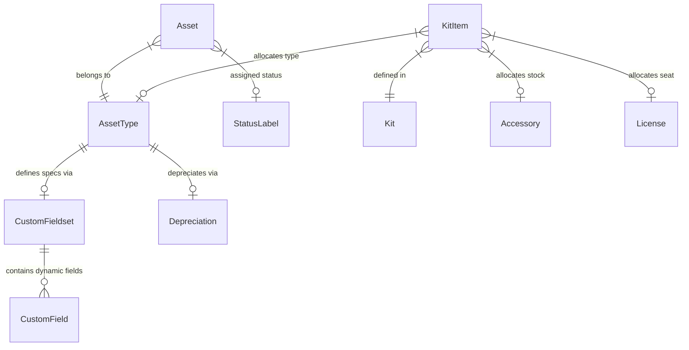
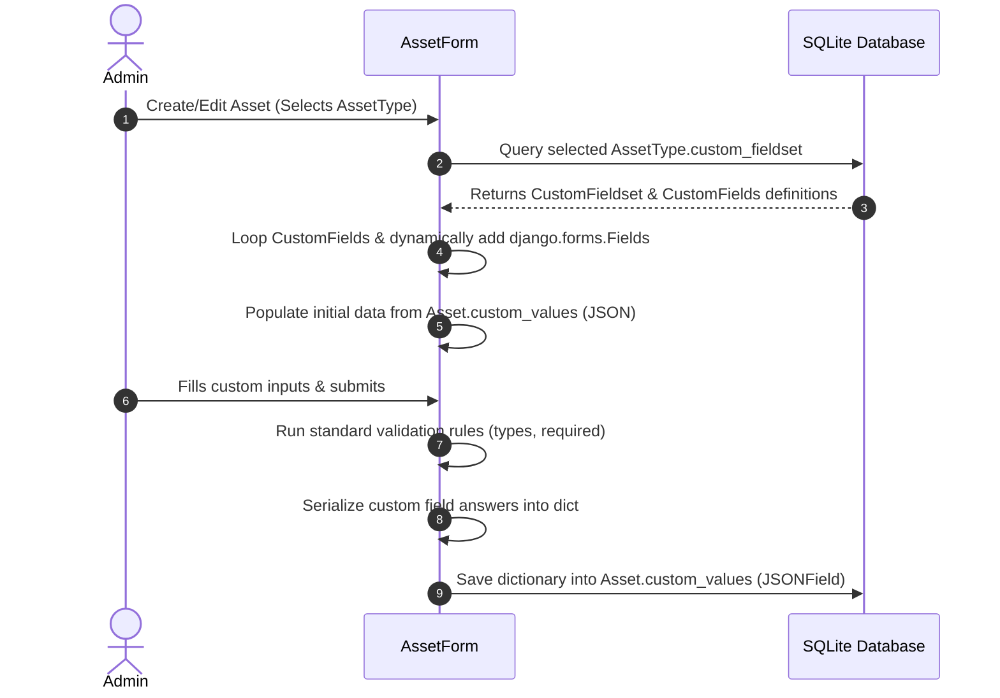
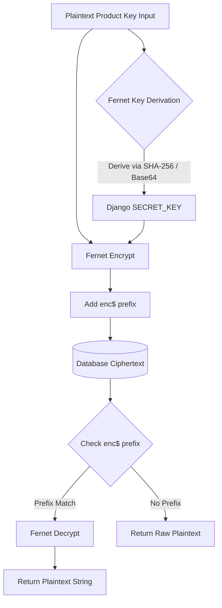

# System Architecture & Data Models

This document describes the technical architecture, database schemas, cryptographic security models, and dynamic user interface rendering flows of **AssetBox**.

---

## 1. Database Entity Relationship Diagram

The core database design revolves around the standard `Asset` and `AssetType` tables, with relationships to status, depreciation, custom field sets, and onboarding kits.



### Models Definitions

#### `CustomField`
Defines dynamic inputs.
*   `name` (`SlugField`): Sluggified system name (e.g. `sim_number`).
*   `label` (`CharField`): Form display label (e.g. `SIM Card Number`).
*   `field_type` (`CharField`): Type selection (`text`, `number`, `date`, `boolean`, `select`).
*   `choices` (`TextField`): New-line separated dropdown values.
*   `required` (`BooleanField`): Dictates form validation constraints.

#### `CustomFieldset`
Groups fields.
*   `name` (`CharField`): Identification header.
*   `fields` (`ManyToManyField` to `CustomField`): Linked inputs.

#### `Depreciation`
*   `name` (`CharField`): Identification header.
*   `months` (`PositiveIntegerField`): Lifespan in months.

#### `Kit` & `KitItem`
Kitting catalog bundles.
*   `KitItem` has unique validation constraints requiring exactly one of: `asset_type`, `accessory`, or `license` to be assigned.

---

## 2. Dynamic JSON Custom Field Rendering

The custom specifications engine uses the following flow to render, validate, and save dynamic metadata in standard forms without database schema migrations:



---

## 3. Cryptographic Security for Product Keys

To secure software activation product keys at rest, the licenses module implements symmetric encryption using AES-CBC with HMAC-SHA256 (via `cryptography.fernet`).



*   **Fernet Key Derivation:** To keep environment variable configurations simple, a key is dynamically derived from standard `settings.SECRET_KEY` on startup using SHA-256 and base64.
*   **Plaintext Fallback:** Guarantees 100% backwards-compatibility on existing database records. If the stored string lacks the `enc$` prefix, it is returned untouched. If decryption fails due to a change in the server's key, the encrypted payload falls back gracefully to prevent application crashes.

---

## 4. HTMX Unified Container Boost Swapping

To build a unified, high-performance Single Page Application (SPA) feel, AssetBox utilizes HTMX boosts target-directed at a single container wrapper:

```html
<!-- base.html -->
<body hx-boost="true" hx-target="#page-content-wrapper">
    <div id="page-sidebar">
        <!-- Sidebar Navigation links -->
    </div>
    
    <div id="page-body-main">
        <!-- Swappable page wrapper -->
        <div id="page-content-wrapper">
            <!-- Swapped Content (Breadcrumbs, Page Header, Actions, Tabs, and Body Content) -->
            
            
        </div>
    </div>
</body>
```

*   **Breadcrumbs & Actions Sync:** By placing the breadcrumbs, main page headers, tab lists, and page action buttons (e.g. Edit, Delete) *inside* the `#page-content-wrapper` container alongside the main page content, every boosted sidebar click or table details navigation swaps the entire header state at once.
*   **Template Wrapper Switching:**
    *   **Standard GET:** Returns the whole page compiled using the full `base.html` Tabler dashboard.
    *   **HTMX Boosted GET:** Detects HTMX requests dynamically in `BaseHTMXView` and compiles requests utilizing the partial `base_htmx.html` template. This returns only the `#page-content-wrapper` container itself, along with out-of-band updates for `<title>` tags and system messages/toasts.
