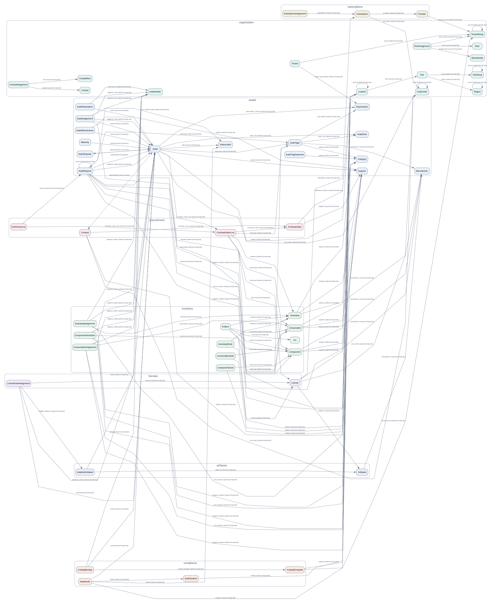
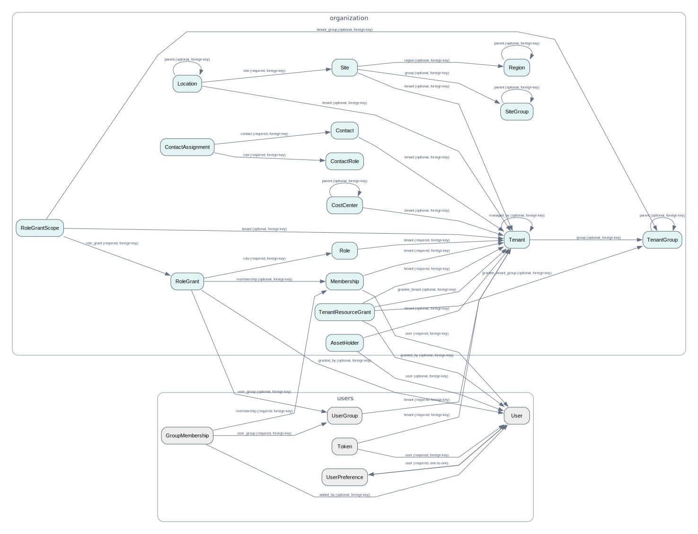

# Data model

## Business domain



The business view suppresses ubiquitous tenant, user, and tag links, letting the
asset, inventory, software, procurement, subscription, and compliance flows
remain readable.

## Tenancy and RBAC



The complete reference graph covers all installed domain models and direct ORM
relations: [SVG](data-model-full.svg) · [DOT source](data-model-full.dot).

All diagrams are generated from Django's installed domain models. A solid arrow
is a foreign key, a double-ended solid arrow is a one-to-one relation, and a
dashed double-ended arrow is a many-to-many relation. Edge labels state the
forward field name and whether the relationship is optional.

Regenerate the sources and images from the repository root:

```powershell
cd itambox
$env:ITAMBOX_ENV = 'dev'
..\.venv\Scripts\python.exe manage.py export_datamodel --apps organization assets inventory licenses software subscriptions procurement compliance --hide-cross-cutting --output docs/development/data-model.dot
dot -Tsvg docs/development/data-model.dot -o docs/development/data-model.svg
..\.venv\Scripts\python.exe manage.py export_datamodel --apps organization users --output docs/development/tenancy-and-rbac.dot
dot -Tsvg docs/development/tenancy-and-rbac.dot -o docs/development/tenancy-and-rbac.svg
..\.venv\Scripts\python.exe manage.py export_datamodel --output docs/development/data-model-full.dot
fdp -Tsvg docs/development/data-model-full.dot -o docs/development/data-model-full.svg
```

To explore one area without the full relationship graph, restrict the command
to specific apps:

```powershell
..\.venv\Scripts\python.exe manage.py export_datamodel --apps organization assets inventory --hide-cross-cutting
```
