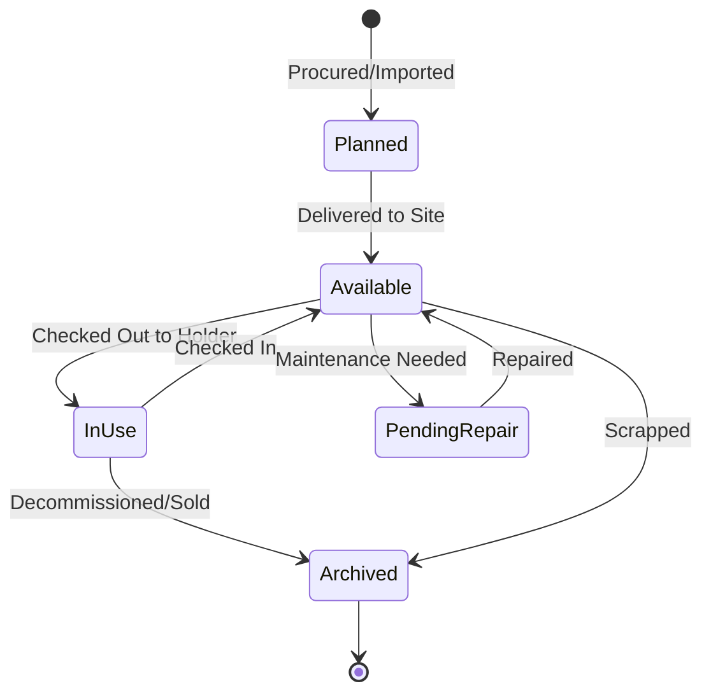

# Introduction to ITAMbox

ITAMbox is an enterprise-grade IT Asset Management (ITAM) platform designed to track the complete lifecycle of physical and digital infrastructure. ITAMbox serves as a centralized source of truth for your organizational hardware, software licenses, SaaS subscriptions, and operation compliance.

## Operational Modules

ITAMbox is organized into the following functional modules:

### Organization
Establish the physical geography (Regions, Sites, Locations) and financial structure (Tenants, Cost Centers, Asset Holders) of your enterprise. Every asset, license, and subscription is scoped to a tenant for data isolation and cost allocation.

### Assets
Track serialized physical systems — laptops, servers, switches, and peripherals. Manage the full model catalog (Asset Types, Manufacturers, Categories, Status Labels), depreciation schedules, warranties, and the complete check-out/check-in lifecycle.

### Inventory & Stock
Manage bulk non-serialized items: accessories (keyboards, cables), consumables (thermal paste, batteries), and modular hardware components (RAM, SSDs, CPUs). Automatic stock-level tracking with per-location quantities, reorder alerts, and asset allocation.

### Software & Licenses
Maintain a software catalog and track license entitlements — seat counts, product keys (encrypted at rest), expiration dates, and check-out assignments to users or assets.

### SaaS Subscriptions ***(Beta)***
Manage recurring SaaS contracts with billing cycles, renewal tracking, provider relationships, and user seat allocations. Subscription seats roll up to linked license entitlements.

### Procurement ***(Beta)***
Track the purchasing lifecycle: Purchase Orders with approval workflows, Contracts with SLA tracking, and supplier management. POs support draft → approved → ordered → received states with segregation of duties.

### Compliance
Conduct hardware audits with barcode scanning, generate legally binding custody receipts with digital signatures, and schedule preventive maintenance. Custody receipts capture EULA acceptance with tamper-proof verification hashes.

### Extras & Customization
Extend ITAMbox with custom fields, alert rules, webhooks, event-driven automation, saved filters, dashboards, export templates, label/QR code printing, and scheduled reports. The reporting engine and webhook system are ***(Beta)***.

### Users & Authentication
Manage Django user accounts, API tokens, role-based access control (RBAC), tenant memberships, and SSO integrations (LDAP, SAML, OIDC). SCIM 2.0 provisioning is available for identity-provider-driven user lifecycle management ***(Beta)***.

### Plugins ***(Beta)***
Extend ITAMbox with custom Django apps — add models, REST/GraphQL endpoints, sidebar menus, and template injections without modifying core code. The plugin system follows the NetBox plugin model.

---

## The System Registry & Lifecycle

Every physical asset or stock item in ITAMbox follows a strict state-governed workflow:

### Context-Sensitive Help
Every list, detail, and editing view in ITAMbox features an embedded help icon (`mdi-help-circle`) on the breadcrumb header. Clicking it opens a context-specific static page explaining that specific model's fields, business logic rules, and import/export layouts.

### Module Maturity
Modules marked ***(Beta)*** are functional and in active use, but their data model, API shape, or feature set may change between revisions. See the [Module Maturity](development/module-maturity.md) page for the current grade definitions.
