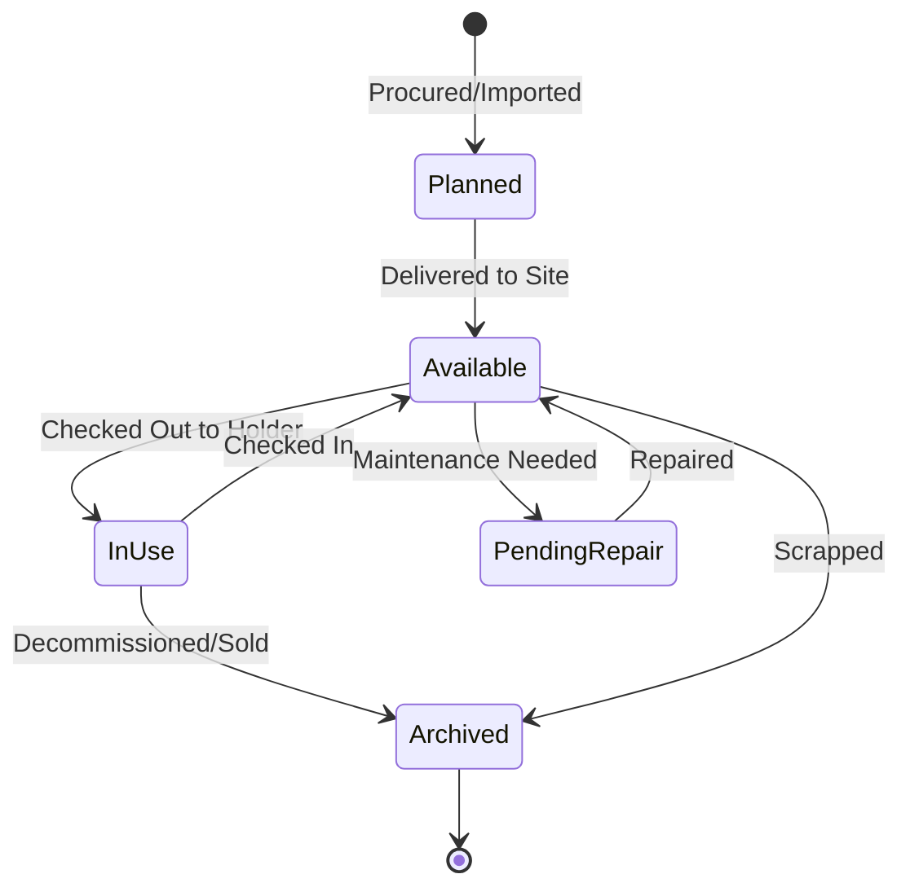

# Introduction to ITAMbox

ITAMbox is an enterprise-grade IT Asset Management (ITAM) platform designed to track the complete lifecycle of physical and digital infrastructure. Inspired by NetBox's data-driven engineering practices and Snipe-IT's visual user-workflows, ITAMbox serves as a centralized source of truth for your organizational hardware, software licenses, SaaS subscriptions, and operation compliance.

## Key Operational Modules

ITAMbox is divided into several logically separated functional modules, each mapping directly to your hardware and software layout:

1. **Organization**: Establish the physical geography (Regions, Sites, Locations) and financial structure (Tenants, Asset Holders) of your enterprise.
2. **Physical Assets**: Track serialized systems (Laptops, Servers, Switches), model catalog parameters (Asset Types, Manufacturers, Categories), and depreciation lifespans.
3. **Inventory & Stock**: Manage bulk accessories (keyboards, cables) and consumables (thermal paste, batteries) with automatic location stock levels, alerts, and modular system component allocations.
4. **Software & SaaS**: Manage license seat distributions, software release profiles, and recurring SaaS contracts.
5. **Operations**: Manage maintenance schedules, vendor records, digital custody checkouts, and hardware audits.

---

## The System Registry & Lifecycle

Every physical asset or stock item in ITAMbox follows a strict state-governed workflow:

### Context-Sensitive Help
Every list, detail, and editing view in ITAMbox features an embedded help icon (`mdi-help-circle`) on the breadcrumb header. Clicking it opens a context-specific static page explaining that specific model's fields, business logic rules, and import/export layouts.
