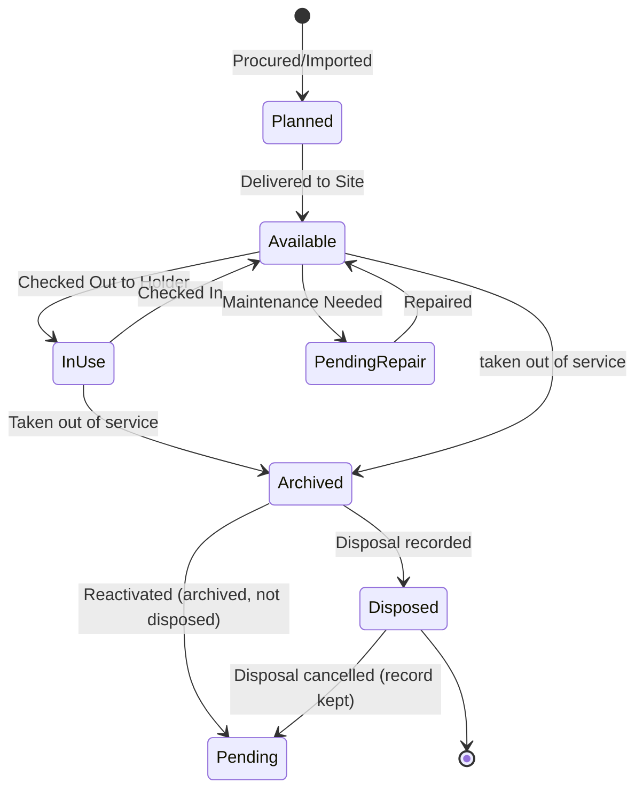

# Introduction to ITAMbox

ITAMbox is an enterprise-grade IT Asset Management (ITAM) platform designed to track the complete lifecycle of physical and digital infrastructure. ITAMbox serves as a centralized source of truth for your organizational hardware, software licenses, SaaS subscriptions, and operation compliance.

## Operational Modules

ITAMbox is organized into the following functional modules:

### Organization
Establish the physical geography (Regions, Sites, Locations) and financial structure (Tenants, Cost Centers, Asset Holders) of your enterprise. Every asset, license, and subscription is scoped to a tenant for data isolation and cost allocation.

### Assets
Track serialized physical systems — laptops, servers, switches, and peripherals. Manage the full model catalog (Asset Types, Manufacturers, Categories, Status Labels), depreciation schedules, warranties, and the complete check-out/check-in lifecycle.

### Inventory & Stock
Manage bulk non-serialized items: accessories (keyboards, cables), consumables (thermal paste, batteries), and modular hardware components (RAM, SSDs, CPUs). Automatic stock-level tracking with per-location quantities, reorder alerts, and asset allocation.

### Software & Licenses
Maintain a software catalog and track license entitlements — seat counts, product keys (encrypted at rest), expiration dates, and check-out assignments to users or assets.

### SaaS Subscriptions
Manage recurring SaaS contracts with billing cycles, renewal tracking, shared Supplier records, and user seat allocations. Subscription seats roll up to linked license entitlements. The **SaaS Subscriptions** capability is **Stable** and always on.

### Procurement
Track the purchasing lifecycle: Purchase Orders with approval workflows, Contracts with SLA tracking, and supplier management. POs support draft → approved → ordered → received states with segregation of duties. Purchase Orders and Contracts are a **Stable** capability; the opt-in Asset Request Procurement Seam remains **Beta**.

### Compliance
Conduct hardware audits with barcode scanning, generate legally binding custody receipts with digital signatures, and schedule preventive maintenance. Custody receipts capture EULA acceptance with tamper-proof verification hashes.

### Extras & Customization
Extend ITAMbox with custom fields, alert rules, webhooks, event-driven automation, saved filters, dashboards, export templates, label/QR code printing, and scheduled reports. **Curated Reports**, **Report Designer**, **Alerts and Notifications**, **Alert Rules and Channels**, and **Webhooks and Event Rules** are **Stable** capabilities; **Scheduled Reports** is **Beta**. Webhooks and Event Rules are always available, but nothing is delivered until an endpoint and an event rule are deliberately created and enabled. Alert Rules and Channels are always available as well — and just as dormant: no rule or channel is ever created or enabled automatically, and nothing is notified until an administrator deliberately creates an active rule with attached, enabled channels.

### Users & Authentication
Manage Django user accounts, API tokens, role-based access control (RBAC), tenant memberships, and SSO integrations (LDAP, SAML, OIDC). SCIM 2.0 provisioning is available for identity-provider-driven user lifecycle management; **SCIM Provisioning** is a **Beta** capability.

### Plugins
Extend ITAMbox with custom Django apps — add models, REST/GraphQL endpoints, sidebar menus, and template injections without modifying core code. The **Plugin System** follows the NetBox plugin model, is opt-in through `ITAMBOX_PLUGINS`, and is graded **Experimental**; plugins run as trusted, unsandboxed in-process code (see the [plugin guide](plugins/getting_started.md)).

---

## The System Registry & Lifecycle

Every physical asset or stock item in ITAMbox follows a strict state-governed workflow:

```mermaid
stateDiagram-v2
    [*] --> Planned: Procured/Imported
    Planned --> Available: Delivered to Site
    Available --> InUse: Checked Out to Holder
    Available --> PendingRepair: Maintenance Needed
    PendingRepair --> Available: Repaired
    InUse --> Available: Checked In
    InUse --> Archived: Taken out of service
    Available --> Archived: taken out of service
    Archived --> Pending: Reactivated (archived, not disposed)
    Archived --> Disposed: Disposal recorded
    Disposed --> Pending: Disposal cancelled (record kept)
    Disposed --> [*]
```

**Archived is not the same as disposed.** `Archived` is an operational state: the
item is out of service and its book value is frozen, but no disposal evidence
exists and the item may be reactivated through the ordinary `archived -> pending`
transition. A **disposal** is recorded as an `AssetDisposal` record (method,
data sanitization, WEEE, recipient) and always stamps the asset, archives it and
closes any active assignment in one operation. An erroneous disposal is
**cancelled** with a mandatory reason: the record stays visible as history and
the asset returns to `pending`.

### Context-Sensitive Help
Every list, detail, and editing view in ITAMbox features an embedded help icon (`mdi-help-circle`) on the breadcrumb header. Clicking it opens a context-specific static page explaining that specific model's fields, business logic rules, and import/export layouts.

### Capability Maturity
Maturity is declared per capability rather than per module, so this overview grades individual capabilities rather than whole modules. The public grades — Stable, Beta, Experimental — and the activation modes of every capability are defined in the [Capability Maturity](operations/capability-maturity.md) guide.
