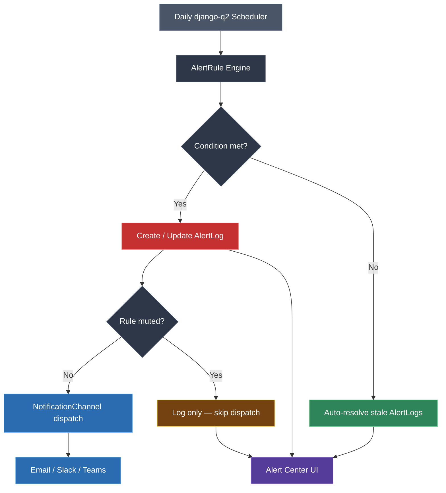

# Alerts & Notifications — how they work

ITAMbox provides an automated alerting system that evaluates threshold conditions
daily and dispatches notifications through your configured channels. The system
helps you stay ahead of low stock, expiring warranties and licenses, upcoming
end-of-life dates, and overdue audits — without having to check dashboards manually.

> **Disclaimer:** Alerts are evaluated once per day by background workers
> (`django-q2`). They are not real-time; the worst-case delay between a condition
> being met and a notification being sent is the next daily evaluation run.

---

## Architecture overview



The whole pipeline lives in `extras/models.py` (models `AlertRule`,
`NotificationChannel`, and `AlertLog`) and `core/events.py` (channel dispatch
logic). Evaluation is triggered by a `django-q2` schedule, not by user actions.

---

## Alert Rules

An **Alert Rule** defines a threshold or time-horizon condition. When the
condition is met, the rule fires — creating an entry in the Alert Log and
optionally dispatching notifications to its attached channels.

### Anatomy of an alert rule

| Field | Type | Description |
|---|---|---|
| **Name** | String (required) | Display name, e.g. _"Low Stock — Patch Cables"_ |
| **Description** | Text | Optional notes explaining the rule's intent |
| **Alert Type** | Choice (required) | What the rule monitors (see table below) |
| **Threshold Value** | Positive integer | Meaning depends on alert type — a count or a day horizon |
| **Severity** | Choice | `info`, `warning`, `critical` — controls badge colour and sorting |
| **Is Active** | Boolean | Inactive rules are skipped entirely during evaluation |
| **Is Muted** | Boolean | Muted rules still create AlertLog entries but send **no** channel notifications |
| **Renotify Interval Days** | Positive integer | How often to re-dispatch while an alert remains unresolved (`0` = notify once) |
| **Channels** | M2M → `NotificationChannel` | Where to send notifications when the rule fires |

### Alert types

| Alert Type | Choice value | Threshold meaning | Example |
|---|---|---|---|
| Low Stock Alert | `low_stock` | Minimum unit count | Notify when patch cables drop below 20 units |
| Upcoming EOL Planning | `upcoming_eol` | Days before EOL date | Warn 90 days before a hardware model reaches end-of-life |
| License Expiry Alert | `license_expiry` | Days before expiry | Alert 30 days before a software license expires |
| Renewal Due Alert | `renewal_due` | Days before renewal date | Remind 14 days before a SaaS contract renews |
| Warranty Expiry Alert | `warranty_expiry` | Days before expiry | Flag devices whose warranty lapses in 60 days |
| Audit Overdue | `audit_overdue` | Days past due date | Escalate audit campaigns that are 7 days overdue |

> [!IMPORTANT]
> For date-horizon alert types (`upcoming_eol`, `license_expiry`, `renewal_due`,
> `warranty_expiry`), the threshold is **days before the event**. For
> `audit_overdue`, the threshold is **days past the scheduled end date**.
> `low_stock` is an absolute quantity threshold.

### Severity levels

| Severity | Badge colour | Use for |
|---|---|---|
| `info` | Blue | Low-urgency heads-ups, routine notifications |
| `warning` | Amber / yellow | Action is needed soon but there is time |
| `critical` | Red | Immediate attention required — missed SLA, stock-out risk |

Warning is the default severity for new rules.

### Creating an alert rule (example)

From the ITAMbox UI (Extras → Alert Rules), click **Add Alert Rule** and fill in:

- **Name:** `Low Stock — Cat6 Cables`
- **Alert Type:** `Low Stock Alert`
- **Threshold Value:** `10`
- **Severity:** `warning`
- **Renotify Interval Days:** `7`

This rule fires whenever the on-hand quantity of Cat6 cables (tracked as a
consumable or component in the inventory) falls to 10 or fewer units. Once
fired, it re-notifies every 7 days until the stock is replenished above the
threshold.

### Muting rules

Set `is_muted = true` when you are aware of a condition and want the alert
**visible in the Alert Center UI** but do **not** want channel notifications
(email, Slack, Teams) to be sent. This is useful during planned maintenance
windows or when you are already working on a fix.

Muted rules:

- Still create `AlertLog` entries on every evaluation where the condition holds.
- Do **not** trigger channel dispatch.
- Can be unmuted at any time to resume notifications.

### Renotification intervals

| Setting | Behaviour |
|---|---|
| `0` | Fire once — never send a repeat notification for the same alert |
| `N` (> 0) | Re-dispatch channel notifications every N days while the alert stays in `active` or `acknowledged` status |

The renotification clock starts from `AlertLog.last_notified_at`. Each
evaluation checks whether enough days have passed since the last dispatch; if
the condition still holds **and** the interval has elapsed, notifications are
re-sent and `last_notified_at` is updated.

### Daily evaluation schedule

Alert rules are evaluated by a `django-q2` scheduled task, typically configured
to run once per day (e.g. at 08:00 UTC). The evaluation engine:

1. Loads all **active** rules for all tenants (system-scoped, not user-scoped).
2. For each rule, queries the target data (inventory levels, expiry dates, audit
   statuses) scoped to the rule's tenant.
3. Compares the current state against the threshold.
4. Creates or updates `AlertLog` entries (see [Alert Log](#alert-log) below).
5. If the rule is not muted and has channels attached, dispatches notifications
   through each channel.

> [!IMPORTANT]
> Because evaluation runs in a background worker context (no request user), the
> engine uses an **unscoped queryset manager** to query across all tenants. Normal
> UI views remain tenant-scoped. This is an implementation detail — it means
> alert evaluation works correctly even when no user is logged in.

---

## Notification Channels

A **Notification Channel** is a destination for alert dispatches. Channels are
configured once and can be attached to multiple alert rules via a
many-to-many relationship.

### Channel types

| Type | Choice value | Transport | Typical config |
|---|---|---|---|
| Email | `email` | SMTP | `smtp_host`, `smtp_port`, `username`, `password`, `use_tls`, `from_email`, `recipients` |
| Slack | `slack` | Incoming Webhook | `webhook_url` |
| Microsoft Teams | `teams` | Incoming Webhook | `webhook_url` |
| In-App | `in_app` | Built-in | No config needed — alerts appear in the Alert Center bell icon |

### Configuring an email channel

1. Go to **Extras → Notification Channels** and click **Add**.
2. Set **Channel Type** to `Email`.
3. Fill in the **Config** JSON:

```json
{
    "smtp_host": "smtp.example.com",
    "smtp_port": 587,
    "username": "alerts@example.com",
    "password": "your-app-password",
    "use_tls": true,
    "from_email": "itambox@example.com",
    "recipients": ["it-team@example.com", "procurement@example.com"]
}
```

> [!IMPORTANT]
> The `config` field is excluded from the change log (`_change_logging_excluded_fields`)
> so SMTP passwords and webhook tokens are never stored in plain-text audit trails.

### Configuring a Slack channel

1. Create an **Incoming Webhook** in your Slack workspace (Slack Admin → Apps → Incoming Webhooks).
2. Copy the webhook URL.
3. In ITAMbox, create a new Notification Channel with **Channel Type** = `Slack`.
4. Paste the webhook URL into the config:

```json
{
    "webhook_url": "https://hooks.slack.com/services/T00/B00/xxxxxx"
}
```

### Configuring a Microsoft Teams channel

1. In your Teams channel, add a **Workflows** → **Post to a channel when a webhook request is received** connector.
2. Copy the webhook URL.
3. In ITAMbox, create a channel with **Channel Type** = `Microsoft Teams`.
4. Paste the webhook URL:

```json
{
    "webhook_url": "https://example.webhook.office.com/webhookb2/..."
}
```

### Attaching channels to alert rules

Once channels are configured, open an alert rule and select one or more channels
in the **Channels** multi-select widget. A single rule can notify through
multiple channels simultaneously:

```
Alert Rule: "License Expiry — Adobe CC"
  └── Channels: [Email: IT Admins], [Slack: #licensing-alerts]
```

Every channel attached to a rule receives the notification when the rule fires.

### Channel dispatch guarantees

| Property | Behaviour |
|---|---|
| Delivery tracking | Each `AlertLog` records per-channel delivery status in `delivery_status` (`ok` / `failed` / error message) |
| SSRF protection | Outbound webhook URLs are validated against `ALLOWED_WEBHOOK_DOMAINS` before dispatch |
| Retry | Failed webhook calls are retried via `django-q2` task retry with exponential backoff |
| Timeout | Webhook requests time out after 10 seconds |

---

## Alert Log

The **Alert Log** is the persistent record of every rule violation. It tracks
the full lifecycle from firing through acknowledgement to resolution.

### Lifecycle states

```mermaid
stateDiagram-v2
    [*] --> active : Rule condition met
    active --> acknowledged : User acknowledges
    acknowledged --> active : Condition re-triggers on next eval
    acknowledged --> resolved : User resolves OR condition clears
    active --> resolved : User resolves OR condition clears (auto-resolve)
    resolved --> active : Same condition fires again (new log created)

    note right of active : unique constraint: one open log\nper rule + target object
    note right of resolved : Resolved logs are exempt\nfrom the uniqueness constraint\nso the condition can legitimately re-fire
```

### Log fields

| Field | Description |
|---|---|
| **Rule** | The parent AlertRule that triggered this log |
| **Subject** | Short summary (e.g. _"Low Stock: Cat6 Cables (3 units remaining)"_) |
| **Message** | Detailed explanation of the violation |
| **Severity** | Copied from the rule at fire time (`info` / `warning` / `critical`) |
| **Target object** | Generic foreign key to the affected entity (consumable, license, asset, audit campaign, etc.) |
| **Status** | `active` → `acknowledged` → `resolved` |
| **Delivery Status** | JSON dict mapping channel PKs to delivery outcomes |
| **Last Notified At** | Timestamp of most recent channel dispatch (drives renotification) |
| **Acknowledged By** / **Resolved By** | Which user performed the action |
| **Resolution Notes** | Free-text description of corrective action taken |
| **Resolved At** | When the alert was closed |

### Deduplication

The database enforces a **partial unique constraint** on `(rule, content_type, object_id)`
for rows with status `active` or `acknowledged`. This means:

- Only **one open alert** can exist for a given rule + target combination.
- If the engine detects the same condition again while an open alert exists, it
  **updates** the existing log (bumps severity, updates the message) rather than
  creating a duplicate.
- Once an alert is **resolved**, the constraint no longer applies — the
  condition can fire again later, creating a fresh `AlertLog`.

### Auto-resolution

When the daily evaluation runs and finds that a previously-violated condition
has cleared (e.g. stock was replenished, warranty was extended), the engine
automatically transitions the corresponding `AlertLog` to `resolved` status.
This happens without user intervention.

### Viewing the alert log

All alert logs are visible in the **Alert Center** page (accessible via the
bell icon in the top navigation bar). The list view supports:

- Filtering by status (`active`, `acknowledged`, `resolved`)
- Filtering by severity
- Filtering by alert rule
- Tenant-scoped viewing (you only see alerts for your current tenant)

Clicking an alert log entry opens a detail view where you can acknowledge,
resolve, or add resolution notes.

---

## Practical examples

### Example 1: Low-stock alert for consumables

**Scenario:** You want to be notified when USB-C cables drop below 15 units so
procurement can re-order before you run out.

1. Create a Notification Channel:

   | Field | Value |
   |---|---|
   | Name | `Procurement Email` |
   | Channel Type | `Email` |
   | Config | `{"smtp_host": "...", "from_email": "...", "recipients": ["buyer@example.com"]}` |

2. Create an Alert Rule:

   | Field | Value |
   |---|---|
   | Name | `Low Stock — USB-C Cables` |
   | Alert Type | `Low Stock Alert` |
   | Threshold Value | `15` |
   | Severity | `Warning` |
   | Renotify Interval Days | `3` |
   | Channels | `Procurement Email` |

**Result:** Every morning at 08:00, if USB-C cable stock is ≤ 15 units, the
buyer receives an email. If stock stays low, they get a reminder every 3 days.

### Example 2: Warranty expiry dashboard

**Scenario:** Track all devices whose warranty expires within the next 90 days.

- **Alert Type:** `Warranty Expiry Alert`
- **Threshold Value:** `90` (days)
- **Severity:** `Info`
- **Is Muted:** `true`

The rule tracks expiring warranties in the Alert Center without sending emails.
The IT manager reviews the dashboard weekly and proactively extends warranties.

### Example 3: Critical license expiry with Slack escalation

**Scenario:** Adobe Creative Cloud licenses expire in 30 days — notify the
creative team on Slack with critical urgency.

1. Create a Slack Notification Channel with the `#licensing` webhook URL.
2. Create the rule:

   | Field | Value |
   |---|---|
   | Name | `Adobe CC Expiry — Critical` |
   | Alert Type | `License Expiry Alert` |
   | Threshold Value | `30` |
   | Severity | `Critical` |
   | Renotify Interval Days | `1` |
   | Channels | `Slack #licensing` |

**Result:** Starting 30 days before expiry, the `#licensing` channel gets a
daily critical alert until the license is renewed.

---

## Troubleshooting

**Alerts are not firing at all**

: Check that the `django-q2` cluster is running and the scheduled task for alert
  evaluation is configured and not paused. Verify the rule's `is_active` flag is
  set. Inactive rules are skipped entirely.

**I receive no email notifications**

: Verify the Notification Channel is `enabled` and that the SMTP config is
  correct (host, port, credentials, TLS setting). Check the `delivery_status`
  field on the `AlertLog` — it records per-channel outcomes including error
  messages. Also confirm the rule is not muted (`is_muted = false`).

**Slack / Teams notifications never arrive**

: The webhook URL in the channel's `config` may be expired, mistyped, or
  pointing to a deleted integration. The SSRF guard also blocks URLs whose
  domain is not listed in `ALLOWED_WEBHOOK_DOMAINS` — check your Django settings.
  Test the webhook URL with `curl` from the ITAMbox server to rule out network
  issues.

**I see duplicate alert log entries**

: The deduplication constraint should prevent open duplicates. If you see
  duplicates, confirm they don't have different `rule` or `content_object`
  values. Resolved logs can coexist with new `active` logs for the same target —
  this is intentional (a condition cleared, then re-occurred).

**An alert resolved itself without my action**

: This is the auto-resolution feature. When the evaluation engine detects that
  the condition no longer holds (stock replenished, warranty extended, etc.), it
  marks the log as resolved automatically. This is expected behaviour.

**Renotifications are not being sent**

: Check `renotify_interval_days` on the rule — a value of `0` means "notify
  once, never again." If the value is > 0, verify that enough time has passed
  since `AlertLog.last_notified_at`. The interval is calendar days, not
  business days. Also confirm the alert log is still in `active` or
  `acknowledged` status — resolved logs are never re-notified.

**The bell icon shows a stale count**

: The unread-alert counter is tied to `AlertLog` rows. Acknowledge or resolve
  open alerts to clear the badge. If the count persists across page reloads,
  check that your tenant scope matches — switching tenants changes which alerts
  are visible.

**Webhook dispatch fails with SSRF error**

: The outbound webhook URL's domain is not in the `ALLOWED_WEBHOOK_DOMAINS`
  setting. Add the domain (e.g. `hooks.slack.com`, `*.webhook.office.com`) to
  the allowlist and restart the application server.
