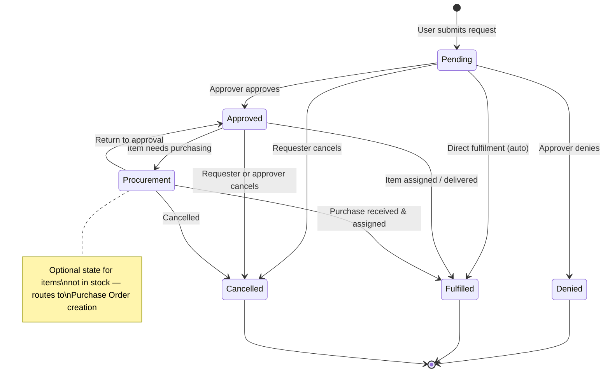
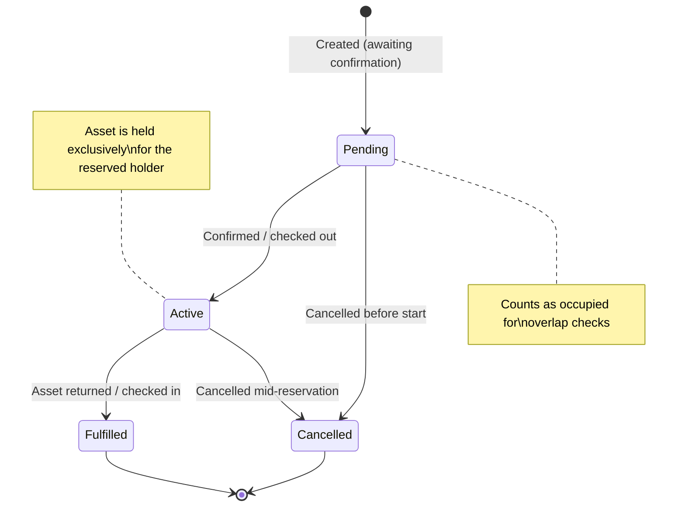

# Asset Requests & Reservations

ITAMbox provides a self-service portal for users to request hardware and a
reservation system to book specific assets for future use. Together they eliminate
spreadsheet-driven procurement and calendar conflicts — every request is traceable,
every reservation is collision-proof at the database level.

---

## Asset Requests

An **Asset Request** is a self-service requisition ticket. Users browse the
catalogue and submit requests for specific assets, asset types, components,
accessories, or consumables. Managers approve or deny them; fulfilment creates
the corresponding assignments and stock deductions.

### Creating a Request

Navigate to **Assets → Requests** and click **Add Request**. Fill in:

| Field | Required | Description |
|---|---|---|
| **Requester** | Yes | The user submitting the request (pre-filled for self-service; can be delegated with the `add_delegated_assetrequest` permission) |
| **Requested Item** | Yes | Choose ONE of: Asset, Asset Type, Component, Accessory, or Consumable |
| **Quantity** | Yes | How many units (default 1). Must be > 0 |
| **Source Location** | No | Preferred warehouse or stock location to pull from |
| **Assigned User** | No | Who the item is ultimately for (may differ from the requester) |
| **Assigned Location** | No | Where the item should be deployed |
| **Notes** | No | Justification, urgency, or other context for the approver |

> [!IMPORTANT]
> You must select exactly one item category per request (asset, asset type,
> component, accessory, or consumable). A database-level check constraint
> (`exactly_one_requested_category`) enforces this — combining a laptop AND a
> monitor in one request is not possible. Use **bulk requests** (group requests)
> for multi-item requisitions.

### Validation Gating

When creating a request, ITAMbox enforces several rules:

- The requested item must be **marked as requestable** (assets must have
  `is_requestable=True`; asset types must have `requestable=True`).
- The requested asset must be in **deployable** status.
- **Duplicate detection**: you cannot create a second pending or approved
  request for the same item with the same assignee.
- Quantity must be greater than zero.
- If both a specific asset and an asset type are selected, the asset must
  belong to that type.

### Approval Workflow

Requests follow a strict state machine with database-enforced transitions:



#### Status Reference

| Status | Meaning | Next Steps |
|---|---|---|
| **Pending** | Submitted, awaiting review | Approve, deny, or cancel |
| **Approved** | Cleared for fulfilment | Assign stock, or move to Procurement |
| **Procurement** | Needs purchasing (not in stock) | Create Purchase Order; fulfil when received |
| **Denied** | Rejected by approver | Terminal — no further action |
| **Fulfilled** | Delivered and assigned | Terminal — the item is now in use |
| **Cancelled** | Withdrawn by requester or approver | Terminal |

#### Auto-Approval for Low-Risk Items

Accessory and consumable requests below configured quantity thresholds are
**automatically approved** on creation if sufficient stock exists:

| Item Type | Default Threshold | Behaviour |
|---|---|---|
| Accessory | ≤ 3 units | Auto-approved if `available >= qty` |
| Consumable | ≤ 5 units | Auto-approved if `available >= qty` |

Thresholds are configured via `REQUISITION_AUTO_APPROVAL_THRESHOLDS` in your
Django settings. Set a threshold to `0` to disable auto-approval for that
category entirely.

> [!IMPORTANT]
> Auto-approval is **advisory only** — it reserves no stock. Capacity is
> enforced at fulfilment time, so a generous threshold can only over-approve,
> never over-allocate.

### Bulk Requests (Group Requests)

When you need multiple items at once, use **Group Requests**:

1. Create a parent request with **Is Group** = `true` (this request itself
   doesn't specify an item — it acts as a container).
2. Add child requests (`sub_requests`) under the parent, each with its own
   item category, quantity, and assignee.
3. The group tracks the **unallocated count** — how many child requests still
   need concrete items assigned.

Group requests are useful for:
- **New hire onboarding**: one group request with laptop, monitor, keyboard,
  mouse, and headset as individual child requests.
- **Department refresh**: request 20 laptops of a specific asset type, tracked
  as a batch.
- **Event staging**: temporary equipment pools for conferences or training rooms.

### Notifications on Status Changes

ITAMbox fires **Event Rules** when a request changes status. Configure these
under **Extras → Event Rules** to send notifications via email, Slack, Teams,
or webhooks. Common event hooks:

| Trigger | Typical Action |
|---|---|
| Request created (status = pending) | Notify the approval queue |
| Request approved | Notify the requester — "Your request is approved" |
| Request denied | Notify the requester with `response_notes` |
| Request fulfilled | Notify the requester — "Your item is ready" |
| Request moved to procurement | Notify the procurement team |

The `responded_by` and `response_notes` fields are populated when an
administrator acts on a request, providing an audit trail of who approved or
denied it and why.

### Permissions

| Permission | Who Needs It |
|---|---|
| `assets.add_assetrequest` | All users (self-service) |
| `assets.add_delegated_assetrequest` | Managers requesting on behalf of others |
| `assets.approve_assetrequest` | Approvers |
| `assets.fulfill_assetrequest` | Fulfilment / IT operations staff |
| `assets.view_assetrequest` | Anyone who should see the request queue |

---

## Asset Reservations

An **Asset Reservation** books a specific physical asset for a holder within a
defined date window. Use it for:

- **Project assignments**: reserve a high-end workstation for a 3-month
  rendering project.
- **Training rooms**: book laptops for a week-long class.
- **Conference & event equipment**: reserve AV gear, projectors, and demo
  machines.
- **Seasonal staff**: pre-book equipment for temporary workers before their
  start date.

### Creating a Reservation

Navigate to the asset's detail page and click **Reserve**, or go to
**Assets → Reservations → Add**. Fill in:

| Field | Required | Description |
|---|---|---|
| **Asset** | Yes | The specific asset to reserve |
| **Reserved For** | No | The AssetHolder who will use the asset |
| **Start Date** | Yes | First day of the reservation (inclusive) |
| **End Date** | Yes | Last day of the reservation (inclusive) |
| **Purpose** | No | Brief reason (e.g. "Q3 video editing project") |
| **Notes** | No | Additional terms or conditions |

### Reservation Lifecycle



#### Status Reference

| Status | Meaning |
|---|---|
| **Pending** | Reserved but not yet active — blocks the calendar but hasn't started |
| **Active** | Currently in effect — the asset is held exclusively |
| **Fulfilled** | Completed successfully — asset has been returned |
| **Cancelled** | Cancelled before or during the reservation |

### Double-Booking Prevention (btree_gist)

ITAMbox prevents overlapping reservations at **two layers**:

#### 1. Database-Level Exclusion Constraint

A PostgreSQL `ExclusionConstraint` using the `btree_gist` extension makes
double-booking **impossible at the row level**:

```sql
-- Simplified representation of the constraint
EXCLUDE USING gist (
    asset WITH =,
    daterange(start_date, end_date, '[]') WITH &&
)
WHERE status IN ('pending', 'active') AND deleted_at IS NULL
```

Key design decisions:

- The date range is **inclusive on both ends** (`[]`): `end_date` is the last
  day the asset is held. Two reservations that share a boundary day **conflict**
  — you must leave at least one clear day between bookings.
- A **one-day reservation** has `start_date == end_date`.
- Only `pending` and `active` reservations participate in the constraint.
  Fulfilled and cancelled reservations do not block the calendar.
- Soft-deleted reservations are excluded — deleting a reservation releases its
  window immediately.

#### 2. Python-Level Validation (Defence-in-Depth)

The `AssetReservation.clean()` method performs the same overlap check in
Python so the UI can show a user-friendly error message before the database
rejects the write.

> [!IMPORTANT]
> The `btree_gist` extension must be enabled in your PostgreSQL database:
> ```sql
> CREATE EXTENSION IF NOT EXISTS btree_gist;
> ```
> ITAMbox migrations handle this automatically, but if you're restoring to a
> fresh database, ensure the extension is available.

### Checking for Conflicts

Before creating a reservation, use the asset's detail page to see its
**Reservation Calendar** — a visual timeline showing all existing bookings.
The API also exposes an overlap check endpoint:

```
GET /api/assets/reservations/check_overlap/?asset=<id>&start=<date>&end=<date>
```

Returns `{"overlap": true, "conflicting": [...]}` or `{"overlap": false}`.

### Checkout Integration

Reservations integrate with ITAMbox's checkout workflow:

1. **Reserve the asset** (status = `pending`).
2. When the reservation's `start_date` arrives, check out the asset to the
   reserved holder. The reservation transitions to `active`.
3. When the asset is returned (checked in), the reservation transitions to
   `fulfilled`.

You can also **check out an asset directly from the reservation detail page**
— ITAMbox prefills the checkout form with the reservation's holder, dates,
and asset.

### Reservation Calendar View

The asset detail page includes a reservation timeline showing:

- All active and pending reservations for the asset.
- Colour-coded status indicators (green = active, amber = pending).
- The reserved holder's name and purpose for each booking.

### Soft Deletion

Deleting a reservation (soft delete) immediately releases its date window.
The reservation record is preserved in the database with `deleted_at` set,
but it no longer participates in overlap checks. This means:

- You can delete a stale reservation and immediately create a new one for
  the same dates.
- Deleted reservations are excluded from the calendar view by default but
  remain queryable by administrators.

---

## Troubleshooting

### Requests

**"You already have a pending or approved request for this item"**

: The duplicate detection check found an existing open request for the same
  item with the same assignee. Either wait for the existing request to be
  resolved, cancel it, or change the assignee.

**"The asset is not requestable"**

: The asset's `is_requestable` flag is `false`, or its status type is not
  `deployable`. An administrator can enable requestability on the asset's
  edit page, or you can request by asset type instead.

**"Invalid state transition"**

: The status change you attempted is not allowed by the state machine. For
  example, a denied request cannot be re-approved — create a new request
  instead. A fulfilled request cannot be cancelled — unassign the item first.

**Auto-approval is not triggering**

: Check that `REQUISITION_AUTO_APPROVAL_THRESHOLDS` is configured with
  positive thresholds. Auto-approval only applies to accessories and
  consumables, and only when sufficient stock is available. Asset and
  component requests always require manual approval.

### Reservations

**"An active or pending reservation already exists"**

: The date window overlaps with an existing reservation for the same asset.
  Check the reservation calendar on the asset detail page to see conflicting
  bookings. Either choose different dates, a different asset, or cancel the
  conflicting reservation first.

**Reservation was rejected by the database but passed the form check**

: This is a race condition — another reservation was created between the
  form validation and the database write. This is extremely rare but possible
  under high concurrency. Refresh the page and try again; the calendar view
  will now show the conflicting reservation.

**"btree_gist extension is not available"**

: The PostgreSQL extension is missing. Run:
  ```sql
  CREATE EXTENSION IF NOT EXISTS btree_gist;
  ```
  as a superuser. This is a one-time setup per database cluster.

**A cancelled reservation still blocks my dates**

: Cancelled and fulfilled reservations are excluded from the overlap
  constraint. If you're seeing a conflict, the blocking reservation is
  likely still `pending` or `active`. Double-check its status. If a
  reservation appears to be cancelled but still blocks, it may only be
  soft-deleted — soft-deleted rows are also excluded, so verify the status
  field directly in the database.
