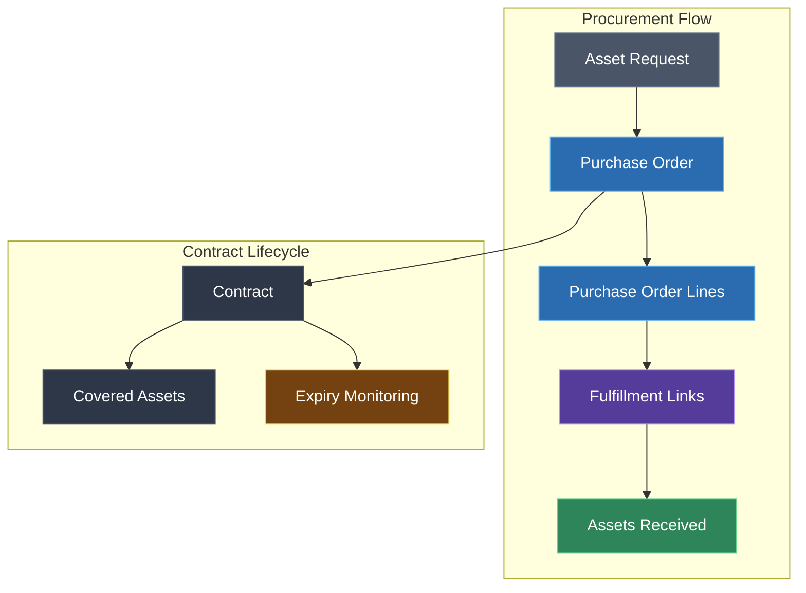
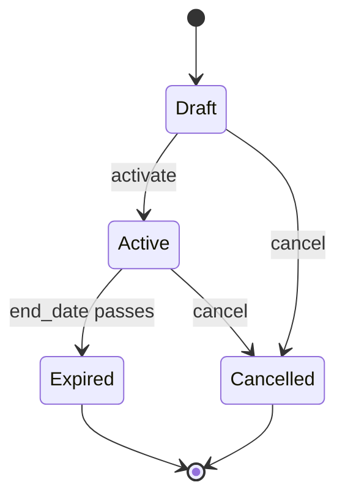
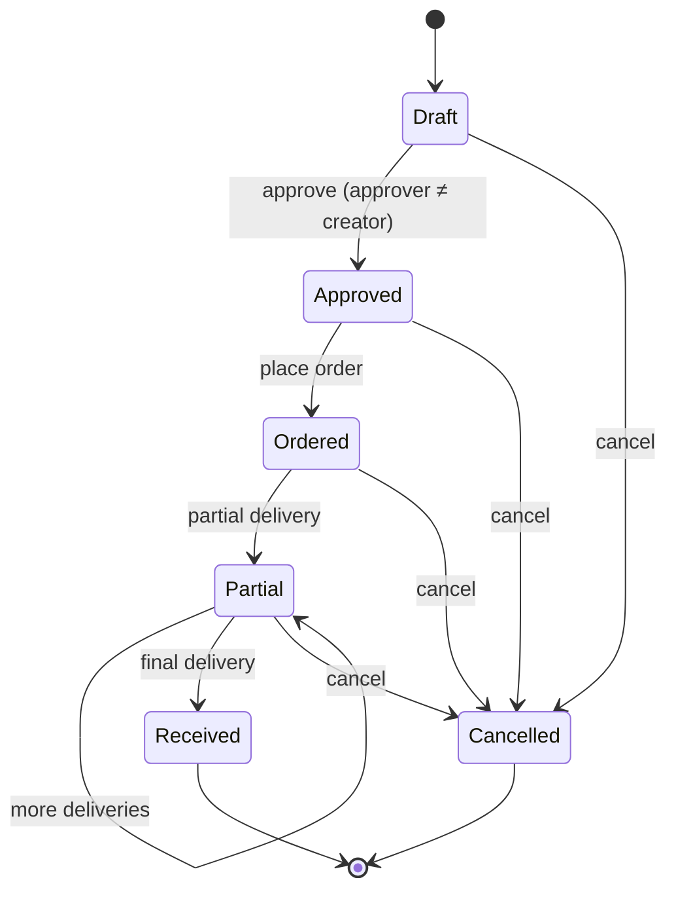

# Contracts & Purchase Orders — how procurement works

ITAMbox tracks the full procurement lifecycle — from drafting a purchase order
through supplier delivery to ongoing contract management. Contracts link
commercial terms (SLAs, billing cycles, renewal dates) to the physical assets
they cover, while Purchase Orders enforce segregation of duties and track line
items through delivery.

---

## Architecture overview



Models live in `procurement/models.py`: `PurchaseOrder`, `PurchaseOrderLine`,
`Contract`, and `FulfillmentLink`.

---

## Contracts

A **Contract** represents a service agreement, hardware/software support
agreement, SLA, lease, or warranty contract. It links commercial parameters
with the physical assets covered under the agreement.

### Lifecycle



| Status | Meaning | Typical next action |
|---|---|---|
| **Draft** | The contract is being prepared. Not yet in effect. | Review terms, link covered assets, then activate. |
| **Active** | The contract is in force. SLA terms apply, billing cycles run. | Monitor expiry, manage renewals. |
| **Expired** | The `end_date` has passed without renewal. The contract is no longer in effect. | Decide: renew as new contract, or let it lapse. |
| **Cancelled** | The contract was terminated before its natural end. | Archive or delete. |

> [!IMPORTANT]
> The status lifecycle is **manual** — the system does not automatically
> transition Draft → Active or Active → Expired. You must update the `status`
> field yourself. However, the `days_until_expiry` and `is_expiring_soon`
> properties are calculated automatically and can be used in reports,
> dashboards, and alert rules.

### Contract types

| Type | Use case | Example |
|---|---|---|
| `support` | Technical support agreement | Dell ProSupport for servers |
| `maintenance` | Hardware/software maintenance | Annual printer maintenance contract |
| `lease` | Equipment leasing | 36-month laptop lease |
| `warranty` | Extended warranty coverage | 5-year server warranty extension |
| `service` | Professional services | Managed firewall service |
| `other` | Anything not covered above | Data centre colocation agreement |

### Key fields

| Field | Description |
|---|---|
| **Name** | Display name, e.g. `Dell ProSupport — Server Cluster` |
| **Contract Number** | Unique identifier (unique across all active contracts) |
| **Supplier** | The vendor providing the contract |
| **Start Date** | When the contract takes effect |
| **End Date** | When the contract expires |
| **Cost** | Total or per-cycle cost |
| **Currency** | ISO 4217 currency code (falls back to the tenant default) |
| **Billing Cycle** | `monthly`, `quarterly`, `annual`, `biannual`, `multi_year`, or `onetime` |
| **Auto-Renew** | If enabled, the contract is expected to renew automatically |
| **Renewal Date** | Date by which a renewal decision should be made (separate from `end_date`) |
| **Cost Center** | For financial allocation |

### SLA fields

| Field | Description | Example |
|---|---|---|
| **SLA Response Time** | How quickly the supplier must respond to an incident | `4 business hours` |
| **SLA Resolution Time** | How quickly the supplier must resolve an incident | `1 business day` |
| **Coverage Hours** | When support is available | `24x7`, `9-5 Mon-Fri` |
| **SLA Terms** | Full text or summary of the SLA agreement | Free-text field |

### Covered assets

The **Covered Assets** many-to-many field links the contract to the specific
assets it protects. A single asset can be covered by multiple contracts
(e.g. a server covered by both a hardware warranty and a software support
contract).

To add covered assets:
1. Open the contract detail page.
2. Use the asset picker to search and select assets.
3. Save — the link is bidirectional (visible on both the contract and the
   asset detail pages).

### Expiry monitoring

Two computed properties help you stay ahead of expiring contracts:

| Property | Behaviour |
|---|---|
| `days_until_expiry` | Calendar days remaining until `end_date`. Negative if already expired. |
| `is_expiring_soon` | `True` when `0 ≤ days_until_expiry ≤ 30` |

Use these in:
- **Dashboard widgets** — show contracts expiring within 30 days.
- **Alert Rules** — create a `renewal_due` alert that fires when a contract
  is approaching its `renewal_date`.
- **Scheduled Reports** — email a monthly contract expiry report to
  procurement.

> [!NOTE]
> `is_expiring_soon` is a hard-coded 30-day window. For different thresholds
> (60 days, 90 days), use `days_until_expiry` directly in your reports or
> create an alert rule with the desired day value.

### Billing cycles

| Cycle | Charged | Typical use |
|---|---|---|
| `monthly` | Every month | SaaS subscriptions, managed services |
| `quarterly` | Every 3 months | Maintenance retainers |
| `annual` | Once per year | Hardware support, warranties |
| `biannual` | Twice per year | Specialised service contracts |
| `multi_year` | Every 2+ years | Long-term leases |
| `onetime` | Once only | One-off professional services |

The billing cycle is **informational** — it does not automatically generate
invoices or trigger payments. Use it for budget forecasting and cost reporting.

### Auto-renewal

Set `auto_renew = True` for contracts that renew automatically. This is a
**flag only** — the system does not auto-extend dates. Use it together with
`renewal_date` to track which contracts need manual review versus those
that will roll over:

| Auto-Renew | Renewal Date set | Meaning |
|---|---|---|
| Yes | Yes | Contract rolls over automatically; review before `renewal_date` if you want to cancel |
| Yes | No | Contract rolls over automatically on `end_date` |
| No | Yes | Manual renewal required by `renewal_date` |
| No | No | Contract terminates on `end_date` |

---

## Purchase Orders

A **Purchase Order (PO)** represents a procurement request dispatched to a
supplier. It tracks the full purchasing lifecycle — from draft proposal
through approval and partial deliveries to final receipt.

### Lifecycle



| Status | Meaning | Required permission |
|---|---|---|
| **Draft** | The PO is being prepared. Editable. | — |
| **Approved** | The PO has been reviewed and approved by a different user. Ready to order. | `approve_purchaseorder` |
| **Ordered** | The PO has been formally placed with the supplier. | — |
| **Partial** | Some line items or quantities have been received, but not all. | `receive_purchaseorder` |
| **Received** | All line items have been fully received. Terminal state. | `receive_purchaseorder` |
| **Cancelled** | The PO was cancelled before full receipt. | — |

### Segregation of duties

ITAMbox enforces a critical procurement control: **the user who approves a PO
must not be the same user who created it.**

- The `created_by` field records who drafted the PO.
- The `approve_purchaseorder` permission is required to move a PO from
  `draft` to `approved`.
- The system validates at the application level that `approver ≠ creator`.

This prevents a single person from both requesting and authorising a purchase —
a fundamental internal control.

### Line items

Each PO contains one or more **Purchase Order Lines** (model
`PurchaseOrderLine`). A line represents an item being ordered:

| Field | Description |
|---|---|
| **Item type** | Exactly one of: `asset_type`, `component`, `accessory`, `consumable`, or `license` |
| **Qty Ordered** | Units ordered (default: `1`) |
| **Qty Received** | Units delivered so far (default: `0`, updates as deliveries arrive) |
| **Unit Price** | Price per unit (optional) |

!!! warning "One item type per line"
    A line item must reference **exactly one** item type. You cannot have a
    line that references both an `asset_type` and a `component` — the `clean()`
    method enforces this. Create separate lines for different item types.

#### Computed line properties

| Property | Formula |
|---|---|
| `qty_outstanding` | `max(0, qty_ordered - qty_received)` |
| `total_cost` | `unit_price × qty_ordered` (or `None` if no unit price) |
| `currency` | Delegates to the parent PO's currency |

### Delivery tracking

Track deliveries by updating `qty_received` on each line:

1. Open the PO detail page.
2. For each line that arrived, increment `qty_received`.
3. The PO status updates:
   - If all lines have `qty_received ≥ qty_ordered` → `received`
   - If some (but not all) lines are fulfilled → `partial`

The `receive_purchaseorder` permission controls who can record deliveries.

### Fulfillment links

A **FulfillmentLink** connects an `AssetRequest` (a user's request for
equipment) to the `PurchaseOrderLine` that will supply it. This closes the
loop from request to procurement:

```
AssetRequest  ──→  FulfillmentLink  ──→  PurchaseOrderLine  ──→  PurchaseOrder
```

When the PO is received, the linked asset requests can be fulfilled.

### Key constraints

| Constraint | Enforcement |
|---|---|
| `order_number` unique per tenant | Database unique constraint (soft-delete-aware) |
| `created_by ≠ approver` | Application-level validation |
| One item type per line | Model `clean()` |
| `end_date ≥ start_date` (contracts) | Database check constraint |

### Permissions

| Permission | Who gets it | What it allows |
|---|---|---|
| `approve_purchaseorder` | Procurement managers, team leads | Move a PO from `draft` to `approved` |
| `receive_purchaseorder` | Warehouse staff, IT ops | Record deliveries by updating `qty_received` |

Standard Django model permissions (`add`, `change`, `delete`, `view`) also
apply and should be assigned according to your organisation's role matrix.

---

## Best practices for procurement workflows

### 1. Separate creation from approval

Always ensure the person creating a PO (`created_by`) is **not** the same
person who approves it. ITAMbox enforces this at the application level, but
your organisation should reinforce it with policy:
- Draft POs should be created by the person who needs the equipment.
- Approval should come from a budget holder or procurement manager.
- Receiving should be done by the person who physically handles the delivery.

### 2. Use contracts to track covered assets

For every support contract, warranty, or lease, link the **covered assets**
immediately after activating the contract. This gives you:
- A single view of all contracts covering a given asset.
- Auditability — you can prove which assets are under warranty when a
  vendor asks.
- Expiry dashboards that show *which* assets are about to lose coverage.

### 3. Set renewal dates and auto-renew flags

Don't rely on `end_date` alone:
- Set `renewal_date` to a date **before** `end_date` (e.g. 60 days prior) —
  this is your decision window.
- Set `auto_renew = True` for contracts that roll over automatically, so
  you can filter them out of manual review lists.
- Create an **alert rule** (`renewal_due` type) with a threshold matching
  your notice period to get automated reminders.

### 4. Use line items granularly

Break large orders into specific line items rather than one catch-all line:
- Each distinct product type gets its own line.
- This makes delivery tracking (`qty_received`) granular and accurate.
- Unit prices per line feed into total cost calculations and budget
  reporting.

### 5. Link purchase orders to contracts

When a contract originates from a purchase order (e.g. you ordered a 3-year
support contract), set the `purchase_order` field on the contract. This
creates a traceable audit trail from approval to delivery to ongoing service.

### 6. Monitor expiry in dashboards and reports

Create a dashboard widget that surfaces:
- Contracts expiring in the next 30/60/90 days.
- Active contracts grouped by type and supplier.
- Total annual contract spend by cost centre.

Combine this with a scheduled report that emails the procurement team weekly.

### 7. Use cost centres for budget allocation

Assign every contract and purchase order to a **cost centre**. This enables:
- Department-level budget tracking.
- Cross-charging between business units.
- Accurate financial reporting in exports and dashboards.

### 8. Archive, don't delete

Both contracts and purchase orders use soft-delete (`SoftDeleteMixin`). When
a contract expires or a PO is cancelled, consider keeping the record rather
than deleting it:
- Expired contracts provide historical context for renewal negotiations.
- Cancelled POs may still have audit value (why was a purchase cancelled?).
- Soft-deleted records are excluded from normal queries but are recoverable.

---

## Troubleshooting

**I can't approve a purchase order**

: Check that:
  - You have the `approve_purchaseorder` permission.
  - The PO is in `draft` status (you can only approve drafts).
  - You are **not** the `created_by` user — the segregation of duties check
    blocks self-approval. Ask a different authorised user to approve.

**The PO status won't change to "received"**

: The status transitions to `received` only when **all** lines have
  `qty_received ≥ qty_ordered`. Check each line's outstanding quantity:
  ```python
  for line in po.lines.all():
      print(f"{line}: ordered={line.qty_ordered}, received={line.qty_received}, outstanding={line.qty_outstanding}")
  ```
  If any line has `qty_outstanding > 0`, the PO stays in `partial` status.

**I get a validation error when creating a line item**

: You likely tried to set more than one item type, or none at all. A line
  must reference **exactly one** of: `asset_type`, `component`, `accessory`,
  `consumable`, or `license`. Check your form and select exactly one.

**Contract expiry alerts aren't firing**

: Verify:
  - An alert rule of type `renewal_due` exists and is `is_active = True`.
  - The rule's `threshold_value` matches the notice period you expect.
  - The contract's `renewal_date` (not `end_date`) is within the threshold.
  - The `django-q2` scheduler is running and the alert evaluation task is
    configured.

**The order_number already exists**

: `order_number` must be unique per tenant (soft-delete-aware). Check if a
  soft-deleted PO with the same number exists — if so, use a different number
  or restore the old PO.

**The contract_number already exists**

: Same as above — `contract_number` is globally unique across active contracts.
  If an old contract with that number was soft-deleted, use a different number
  or restore the old contract.

**Covered assets aren't showing on the asset detail page**

: The relationship is a `ManyToManyField`. Verify the asset was actually added
  to the contract's `assets` field. Open the contract detail page and check the
  Covered Assets list. The reverse relationship (`asset.contracts`) is available
  on every asset.

**I need to change a PO after it was approved**

: Once a PO is `approved`, it should not be edited freely — this would
  undermine the approval control. If you must make changes:
  - For minor corrections, cancel and re-create as a new draft.
  - For significant scope changes, consider whether a separate PO is more
    appropriate.
  - There is no built-in "un-approve" action in the current release.

**Fulfillment links aren't working as expected**

: A `FulfillmentLink` connects one `AssetRequest` to one `PurchaseOrderLine`
  with a `qty_allocated`. Check that:
  - Both the request and the PO line exist and are active (not soft-deleted).
  - The `qty_allocated` doesn't exceed the line's `qty_ordered`.
  - The link's `asset_request` and `purchase_order_line` are unique together
    (enforced by a database constraint).
