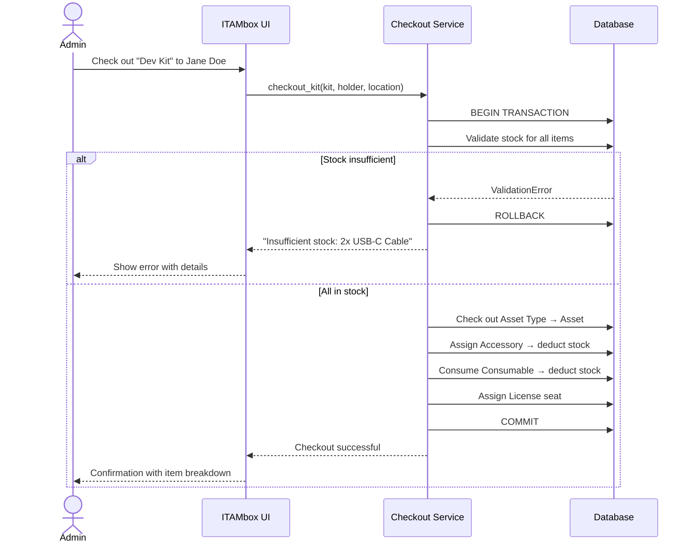
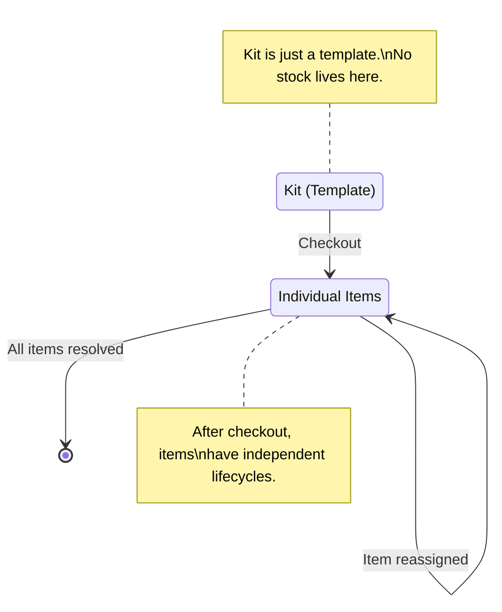
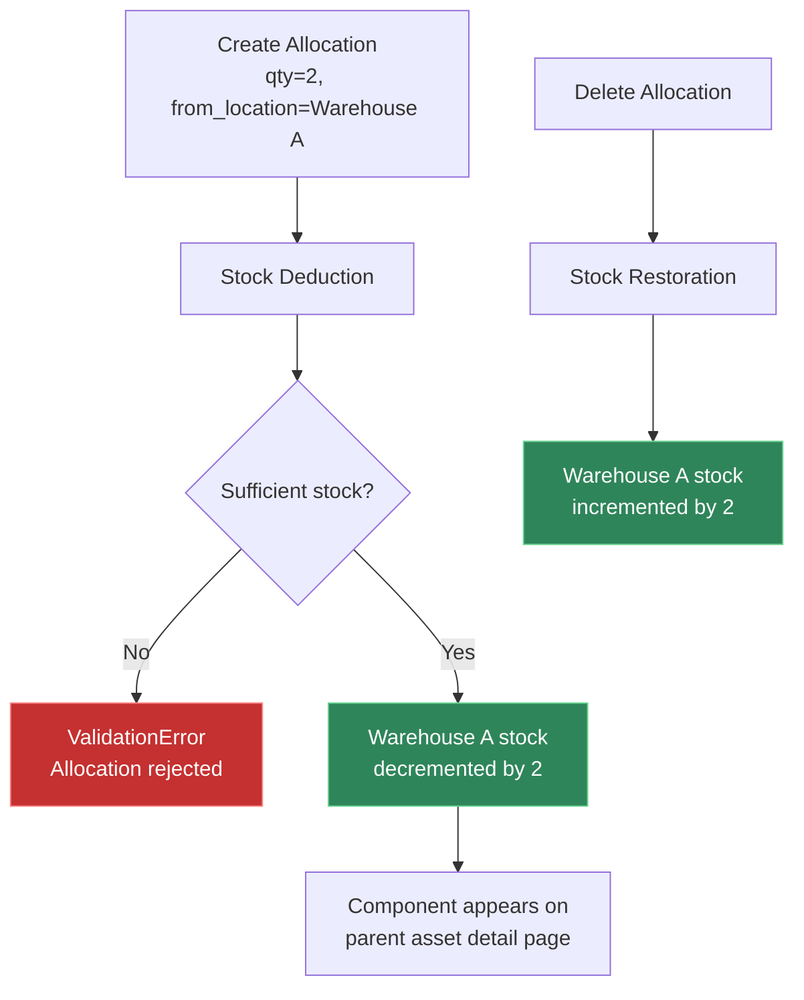

# Kits & Components

ITAMbox tracks hardware at two levels of granularity: **Kits** bundle items
together for rapid deployment, and **Components** track modular sub-assemblies
(RAM, SSDs, CPUs) that are allocated into parent assets. Together they give you
control over both turnkey provisioning and granular hardware lifecycle management.

---

## Kits

A **Kit** is a pre-assembled template of items that are regularly issued
together. Think of it as a "shopping list" that can be checked out in a single
operation — the kit itself doesn't hold inventory; its items pull from their
respective stock pools.

### When to Use Kits

| Use Case | Example Kit |
|---|---|
| New hire onboarding | "Standard Developer Kit" — laptop, monitor, keyboard, mouse, headset |
| Role-based provisioning | "Remote Sales Kit" — laptop, 4G dongle, headset, webcam |
| Conference room staging | "Meeting Room Kit" — display adapter, clicker, cables, HDMI switch |
| Field technician dispatch | "Field Repair Kit" — tools, spare cables, thermal paste, cable ties |
| Temporary event setup | "Trade Show Booth Kit" — tablets, stands, chargers, signage mounts |

### Kit Structure

A Kit contains **Kit Items** — slots that each reference one of five possible
target types:

| Target Type | Example | Quantity Applicable |
|---|---|---|
| **Asset Type** | `MacBook Pro 16"` | No (one asset per slot) |
| **Accessory** | `Dell Wired Keyboard KB216` | Yes |
| **Consumable** | `Thermal Paste MX-4` | Yes |
| **Component** | `16 GB DDR4 SODIMM` | Yes |
| **License** | `Microsoft 365 Business Premium` | No (one seat per slot) |

Each kit item must declare **exactly one** target — a database constraint
(`chk_kit_item_single_target`) prevents a single slot from referencing both
an accessory and a consumable, for example.

### Creating a Kit

Navigate to **Inventory → Kits → Add**:

1. **Name**: Give the kit a unique, descriptive name (e.g. "Standard Developer Onboarding Kit").
2. **Description**: Document who it's for and what it contains.
3. **Tenant**: Leave blank for a global kit visible across all tenants, or
   assign to a specific tenant for private use.
4. **Tags**: Optional labels for filtering and search.

Save the kit, then add items on the kit detail page.

### Adding Items to a Kit

On the kit detail page, click **Add Kit Item** and fill in:

| Field | Required | Description |
|---|---|---|
| **Target** | Yes | Select ONE: Asset Type, Accessory, License, Consumable, or Component |
| **Quantity** | Yes | How many units (default 1). Applies to Accessories, Consumables, and Components. Ignored for Asset Types and Licenses (one per slot) |

!!! warning "One target per item"
    A kit item can only target one thing. If your "Developer Kit" needs BOTH a
    keyboard and a mouse, create two separate kit items — one for the keyboard
    accessory and one for the mouse accessory.

### Checking Out a Kit

When you check out a kit to an AssetHolder or Location, ITAMbox performs an
**atomic multi-item checkout** in a single database transaction:



Key properties of kit checkout:

- **All-or-nothing**: If any item in the kit lacks sufficient stock, the entire
  checkout is rolled back. No partial fulfilment.
- **Stock deduction**: Accessory and consumable quantities are deducted from
  the source location's stock pool automatically.
- **License assignment**: License slots in the kit attempt to assign an
  available seat. If no seat is available, the checkout fails.
- **Asset checkout**: Asset type slots trigger a checkout of the next available
  asset matching that type.

> [!IMPORTANT]
> Kit checkout uses the `checkout_kit` service function (in
> `assets/services.py`), which wraps everything in `transaction.atomic()`.
> Concurrent kit checkouts are safe — database locks prevent double-allocation
> of the same stock.

### Assigning Kits to Users / Locations

Kits themselves are templates, not inventory. Assignment happens at checkout
time:

1. **To an AssetHolder** (user): The checked-out items appear in the holder's
   assigned assets, accessories, and licenses.
2. **To a Location**: The items are checked out to a physical location (e.g.
   "Conference Room A") rather than a person.

After checkout, individual items can be managed separately — returned,
reassigned, or consumed independently of the original kit context.

### Kit Inventory Lifecycle



**Entire kit** vs **individual items**:

| Operation | Entire Kit | Individual Item |
|---|---|---|
| Checkout | Atomic — all or nothing | Pick and choose from the kit |
| Return | Not supported as a unit | Return each item separately |
| Stock tracking | Items pull from their own pools | Each item type has its own stock |
| Audit trail | Kit checkout creates separate assignments | Each assignment is independently auditable |

!!! warning "No bulk return for kits"
    After a kit is checked out, items must be returned individually. There is
    no "return entire kit" operation because each item type has a different
    return workflow (asset check-in, accessory unassignment, consumable
    disposal, license release).

---

## Components

A **Component** is a modular hardware sub-assembly tracked in the inventory
catalogue. Unlike assets (which are individually serialised and tracked),
components exist as a **pooled stock** that gets allocated into parent assets.

### Common Component Examples

| Component Type | Example Model | Typical Parent Asset |
|---|---|---|
| Memory (RAM) | `Crucial 16 GB DDR4-3200 SODIMM` | Laptop, server |
| Solid-State Drive | `Samsung 990 Pro 1 TB NVMe M.2` | Workstation, server |
| Hard Disk Drive | `Seagate Exos 4 TB 7200 RPM` | NAS, server |
| CPU | `Intel Xeon Silver 4314` | Server |
| GPU | `NVIDIA RTX A4000 16 GB` | Workstation |
| Network Card | `Intel X710-DA2 10 GbE` | Server |
| RAID Controller | `Broadcom MegaRAID 9560-8i` | Server |
| Power Supply | `Dell 750 W Hot-Plug PSU` | Server |

### Creating a Component

Navigate to **Inventory → Components → Add**:

| Field | Required | Description |
|---|---|---|
| **Name** | Yes | Unique model name (e.g. "16 GB DDR4-3200 SODIMM") |
| **Manufacturer** | Yes | Hardware vendor (e.g. "Crucial", "Samsung") |
| **Category** | Yes | Must be a category with `applies_to` set to `component` |
| **Part Number** | No | SKU or manufacturer part number |
| **EAN** | No | Barcode for scanning |
| **Specs** | No | JSON dictionary of technical properties |
| **Min Qty** | No | Alert threshold for low-stock warnings |
| **Allow Overallocate** | No | If enabled, permits allocation beyond available stock |
| **Supplier** | No | Preferred vendor for re-ordering |
| **Tenant** | No | Leave blank for global, set for tenant-private catalogue |
| **Notes** | No | Additional details |

#### Specs Field

The `specs` field stores structured technical data as JSON. Use it for
filtering and reporting:

```json
{
    "capacity_gb": 16,
    "type": "DDR4",
    "speed_mhz": 3200,
    "form_factor": "SODIMM",
    "cas_latency": 22,
    "voltage": 1.2
}
```

### Managing Stock per Location

Components are stocked at specific **Locations**. Each location can hold its
own quantity of the same component model:

Navigate to **Inventory → Component Stock → Add**:

| Field | Required | Description |
|---|---|---|
| **Component** | Yes | The catalogue component being stocked |
| **Location** | Yes | The physical location / warehouse room |
| **Quantity** | Yes | Number of units at this location |

#### Stock Summary

The component detail page shows:

| Metric | Formula | Description |
|---|---|---|
| **Total Stock** | `SUM(stocks.qty)` | All stock across all locations |
| **Allocated** | `SUM(allocations.qty WHERE deleted_at IS NULL)` | Currently installed in assets |
| **Available** | `total_stock - total_allocated` | Ready to be installed |

The `available_stock` property is computed from these aggregates and updated
automatically as allocations change.

### Allocating Components to Parent Assets

When you physically install a component into an asset (e.g. putting a new SSD
into a laptop), record the allocation in ITAMbox:

Navigate to **Inventory → Component Allocations → Add**:

| Field | Required | Description |
|---|---|---|
| **Component** | Yes | The component model being installed |
| **Qty** | Yes | How many units (e.g. `2` for a dual-rank RAM kit) |
| **Assigned Asset** | No* | The parent asset receiving the component |
| **From Location** | No | Source warehouse (stock is deducted from here) |
| **Assigned Holder** | No* | The holder if allocated directly to a person |
| **Assigned Location** | No* | The location if allocated to a room |
| **Notes** | No | Slot position, installation notes |

\* Exactly ONE of Assigned Asset, Assigned Holder, or Assigned Location must be set.

#### Automated Stock Control



- **On creation**: The component's stock at `from_location` is decremented by
  the allocated quantity.
- **On deletion (soft or hard)**: The stock is restored to `from_location`,
  maintaining count integrity.
- The stock adjustment is handled by `adjust_inventory_stock()` in
  `inventory/services.py`, called from both `save()` and `delete()`.

> [!IMPORTANT]
> Stock adjustments are **synchronous and transactional**. If the stock
> deduction fails (e.g. insufficient quantity), the entire allocation save is
> rolled back. There is no window where stock and allocations are out of sync.

### Stock Alerts

Configure **Min Qty** on a component to trigger low-stock alerts:

1. Set `min_qty` on the component (e.g. `5`).
2. Create an **Alert Rule** of type `Low Stock Alert` targeting consumables
   and components.
3. When total available stock drops to or below `min_qty`, the alert fires.

Combine with [Alert Rules](alerts-and-notifications.md) for automated email
or Slack notifications.

### Over-Allocation

When **Allow Overallocate** is enabled on a component, you can allocate more
units than are physically in stock. This is useful for:

- **Pre-staging**: Recording planned installations before stock arrives.
- **Backordering**: Tracking demand when supply is constrained.

Use with caution — over-allocated components show **negative available stock**.
The dashboard highlights these with a warning badge.

---

## Troubleshooting

### Kits

**"A kit item cannot select more than one target"**

: Each kit item slot can reference exactly one thing (asset type, accessory,
  license, consumable, OR component). For a kit that needs a keyboard AND a
  mouse, create two separate kit items.

**Kit checkout fails with "Insufficient stock"**

: One or more items in the kit lack sufficient quantity at the source location.
  The error message names the specific item and how many units are missing.
  Replenish stock or choose a different source location with adequate inventory.

**Checked-out kit items don't appear on the holder's profile**

: Verify the checkout completed successfully (check the kit's change log).
  Each item type appears in a different section — assets under "Assigned
  Assets", accessories under "Assigned Accessories", licenses under "License
  Seats". There is no unified "kit" view post-checkout.

**Can I return an entire kit at once?**

: No. Kit checkout creates separate assignments for each item. Return each
  item individually through its respective workflow: check in assets, unassign
  accessories, release license seats. Consumables cannot be "returned" — they
  are consumed permanently.

### Components

**"Cannot allocate — insufficient stock"**

: The requested quantity exceeds available stock at the source location.
  Either reduce the quantity, choose a different source location, or enable
  `allow_overallocate` on the component to permit negative stock.

**Stock count doesn't match physical inventory**

: Check for deleted allocations. Soft-deleted allocations restore stock to
  `from_location`, but hard-deleted allocations also trigger restoration via
  the `delete()` method. If counts are off, run a stock reconciliation:
  ```
  python manage.py reconcile_component_stock
  ```

**Component appears on wrong asset**

: The allocation was created with the wrong `assigned_asset`. Edit the
  allocation record and change the target asset. Stock is rebalanced
  automatically — the original asset loses the component and the new asset
  gains it, with no net stock change (unless the source location differs).

**Low-stock alert not firing**

: Verify the component's `min_qty` is set and that an active alert rule of
  type `Low Stock Alert` exists. The alert engine runs daily via `django-q2`;
  check that the scheduler is running. See the
  [Alerts & Notifications guide](alerts-and-notifications.md) for
  troubleshooting alert delivery.
