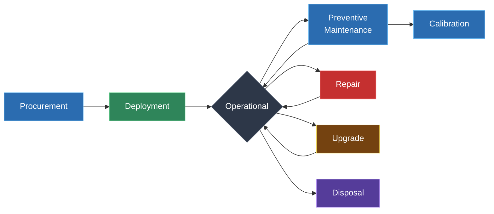

# Software Catalog & Asset Maintenance

ITAMbox tracks both the software your organisation uses and the maintenance
history of your physical assets. The **Software Catalog** is the canonical
registry of approved applications and operating systems. **Asset Maintenance**
logs every repair, upgrade, calibration, and support event — building a
complete service history for each asset.

---

## Software Catalog

The **Software Catalog** is the authoritative list of software titles approved
for use in your organisation. It serves as a template registry — each entry
defines what the software is, not how many licenses you own. Actual license
tracking happens through the **Licenses** module, which references these
catalogue entries.

### Creating a Software Entry

Navigate to **Software → Add**:

| Field | Required | Description |
|---|---|---|
| **Name** | Yes | Full product name (e.g. "Microsoft Visio Professional 2021"). Unique per tenant |
| **Manufacturer** | Yes | Software vendor (e.g. "Microsoft", "Adobe", "JetBrains") |
| **Version** | No | Current version string (e.g. "2021", "16.0", "24.04 LTS") |
| **Category** | No | Functional classification |
| **License Type** | No | Default license model for the product |
| **Website** | No | Product homepage or vendor URL |
| **Description** | No | Notes about the product's purpose or scope |
| **Tenant** | No | Leave blank for a global entry visible to all tenants; set for private catalogues |
| **Tags** | No | Labels for filtering and search |

> [!IMPORTANT]
> Software names are **unique per tenant** (and globally unique for entries
> without a tenant). Two tenants can each have their own "Microsoft 365"
> entry with different metadata, but a single tenant cannot create duplicate
> names. A database-level `UniqueConstraint` enforces this.

### Software Categories

| Category | Choice Value | Typical Use |
|---|---|---|
| **Operating System** | `operating_system` | Windows, macOS, Ubuntu, RHEL |
| **Productivity** | `productivity` | Office suites, email clients, collaboration tools |
| **Development** | `development` | IDEs, compilers, version control, database tools |
| **Security** | `security` | Antivirus, VPN clients, endpoint protection |
| **Design** | `design` | Adobe Creative Cloud, Figma, CAD tools |
| **Other** | `other` | Anything that doesn't fit above |

Categories help organise the catalogue and power filtered reports. Use them
consistently — the SAM (Software Asset Management) compliance dashboard groups
results by category.

### License Types

Each software entry declares its **default license type**. Individual licenses
created under the entry can override this, but the default sets expectations:

| License Type | Choice Value | Characteristics |
|---|---|---|
| **Proprietary** | `proprietary` | Commercial, closed-source. Requires per-seat or per-install licensing |
| **Open Source** | `open_source` | Community or foundation-governed. May have copyleft obligations |
| **Freeware** | `freeware` | Free to use, but not open source. No license fee |
| **Shareware** | `shareware` | Trial-based or limited-feature free version |
| **Subscription** | `subscription` | Recurring payment model (SaaS or term license) |

### Version Tracking

The `version` field stores the **canonical version** of the software as
defined by the vendor. When ITAMbox discovers software on assets (via SCCM,
Intune, Lansweeper, or its own discovery agent), the **discovered version**
is recorded separately in the `InstalledSoftware.version_detected` field.
This lets you compare:

| Field | Source | Example |
|---|---|---|
| `Software.version` | Manually maintained catalogue entry | `16.0` |
| `InstalledSoftware.version_detected` | Discovery agent on the actual asset | `16.78.1` |

Use the **Software Compliance Dashboard** to identify assets running outdated
or unauthorised versions.

### Installed Software

The `InstalledSoftware` model records specific software instances discovered
on assets. Each row captures:

| Field | Description |
|---|---|
| **Asset** | The physical device running the software |
| **Software** | The catalogue entry |
| **Version Detected** | The specific build/version found (e.g. "16.78.1") |
| **Install Date** | When the software was installed (if known) |
| **Discovered By Agent** | Source system: SCCM, Intune, Lansweeper, or manual entry |
| **Last Seen Date** | Most recent detection timestamp |
| **Notes** | Context about this specific installation |

The combination `(asset, software, version_detected)` is unique — the same
version of the same software cannot be recorded twice on the same asset.

### SAM Compliance

The Software Catalog integrates with ITAMbox's **SAM reconciliation engine**:

```python
software.reconcile()
# Returns:
{
    "software_id": 42,
    "software_name": "Microsoft Visio Professional 2021",
    "installed_count": 15,
    "entitled_seats": 12,
    "delta": +3,
    "compliant": False,
    "status": "over_deployed",
}
```

Each software entry can be reconciled to show:

| Status | Meaning | Action |
|---|---|---|
| **compliant** | Licenses ≥ installations | No action needed |
| **over_deployed** | More installations than licenses | Purchase additional seats or uninstall |
| **unlicensed** | No licenses at all | True-up immediately |

The compliance dashboard (under **Software → Compliance**) visualises this
across your entire catalogue.

### Global vs. Tenant-Scoped Software

| Scope | `tenant` field | Visibility | Use Case |
|---|---|---|---|
| **Global** | `NULL` | All tenants | Shared catalogue: Windows, Office, common tools |
| **Tenant-Private** | Specific tenant | That tenant only | Tenant-specific tools or departmental software |

> [!IMPORTANT]
> Tenant-scoped software can only be installed on assets belonging to the
> same tenant. The `InstalledSoftware.clean()` method enforces this — attempting
> to record an installation across tenant boundaries raises a `ValidationError`.

---

## Asset Maintenance

**Asset Maintenance** tracks every service event in an asset's lifecycle:
preventive check-ups, corrective repairs, upgrades, calibrations, and vendor
support calls. Each record builds a permanent service history, visible on the
asset's detail page.

### Maintenance Types

| Type | Choice Value | Examples |
|---|---|---|
| **Upgrade** | `upgrade` | RAM upgrade, SSD replacement, GPU swap |
| **Repair** | `repair` | Screen replacement, fan replacement, PSU repair |
| **Calibration** | `calibration` | Monitor colour calibration, sensor recalibration, torque wrench certification |
| **Software Support** | `software_support` | OS reinstallation, driver updates, application troubleshooting |
| **Hardware Support** | `hardware_support` | Vendor warranty claim, on-site technician visit, remote diagnostics |

### Scheduling a Maintenance Task

Navigate to the asset's detail page and click **Add Maintenance**, or go to
**Compliance → Asset Maintenances → Add**:

| Field | Required | Description |
|---|---|---|
| **Asset** | Yes | The asset receiving service |
| **Maintenance Type** | Yes | One of the five types above |
| **Status** | Yes | Current state (defaults to `Scheduled`) |
| **Start Date** | Yes | When work begins (or is scheduled to begin) |
| **Completion Date** | No | When work was completed |
| **Supplier** | No | External vendor performing the work |
| **Performed By** | No | Name of the technician or engineer |
| **Cost** | No | Direct cost of the service |
| **Currency** | No | ISO 4217 code (defaults to tenant currency) |
| **Description** | No | Summary of the issue or scope of work |
| **Notes** | No | Detailed log of work performed and findings |

### Maintenance Lifecycle

```mermaid
stateDiagram-v2
    [*] --> Scheduled : Maintenance planned
    Scheduled --> InProgress : Work begins
    Scheduled --> Cancelled : No longer needed
    InProgress --> Completed : Work finished
    InProgress --> Cancelled : Aborted

    note right of Scheduled : Appears on the maintenance\\ncalendar; asset remains\\nin its current status
    note left of InProgress : Asset may be marked\\nas under maintenance
    note right of Completed : Service history saved;\\ndowntime calculated
```



#### Status Reference

| Status | Meaning |
|---|---|
| **Scheduled** | Planned but not yet started. Visible on the maintenance calendar |
| **In Progress** | Work is actively underway |
| **Completed** | Work is finished. `completion_date` is set, downtime is calculated |
| **Cancelled** | Work was cancelled before or during execution |

### Downtime Calculation

When a maintenance record has both `start_date` and `completion_date`, ITAMbox
automatically computes the **downtime in days**:

```python
downtime_days = (completion_date - start_date).days
```

This is displayed on the maintenance detail page and aggregated in the asset's
**Service History** panel. Use it to:

- Track **MTTR** (Mean Time To Repair) across your fleet.
- Identify assets with chronic reliability issues.
- Calculate SLA compliance for vendor maintenance contracts.
- Report total downtime per asset type for procurement decisions.

### Linking Maintenance to Assets

Each maintenance record is linked to exactly one asset via a foreign key with
`on_delete=PROTECT`. This means:

- You **cannot delete an asset** that has maintenance records. The asset must
  be disposed of first (which preserves maintenance history as evidence), or
  the maintenance records must be explicitly deleted.
- Maintenance records are **tenant-scoped** through their parent asset
  (`tenant_lookup = 'asset__tenant'`). You only see maintenance for assets in
  your active tenant.
- The asset detail page shows a **Maintenance Timeline** — all records sorted
  by `start_date` descending.

### Attachments & Evidence

Maintenance records support:

- **Image attachments**: Photos of damaged components, before/after shots,
  calibration certificates.
- **File attachments**: PDFs of service reports, warranty claim forms, vendor
  invoices, RMA numbers.
- **Tags**: Categorise with labels like "warranty-claim", "critical",
  "scheduled", "vendor-dispatched".

Upload attachments through the maintenance detail page. Files are stored
alongside the maintenance record and appear in the asset's document history.

### Cloning Maintenance Records

Use the **Clone** action on a maintenance record to create a duplicate for
recurring maintenance:

1. Open a completed maintenance record.
2. Click **Clone**.
3. Adjust the dates, clear the completion date, and reset the status to
   `Scheduled`.

This is ideal for scheduled preventive maintenance (e.g. quarterly server
dust cleaning, annual calibration).

### Exporting

Maintenance records can be exported through **Export Templates**. Create a
template targeting the `compliance | asset maintenance` content type to
generate CSV or JSON reports of all maintenance activity, filterable by date
range, asset type, or maintenance type.

---

## Asset Lifecycles Through Maintenance

Maintenance records tell the story of an asset's operational life. Combined
with ITAMbox's other lifecycle features, they provide a complete picture:



### Lifecycle Data Points per Asset

| Lifecycle Stage | ITAMbox Feature | What It Tracks |
|---|---|---|
| **Procurement** | Purchase Orders, Contracts | Acquisition cost, vendor, PO number, warranty start |
| **Deployment** | Asset Assignments | Who has it, where it's located, since when |
| **Operations** | Asset Status | Current state: deployable, in-use, under maintenance, etc. |
| **Preventive Maintenance** | Maintenance (scheduled, type=upgrade/calibration) | Planned service intervals |
| **Corrective Maintenance** | Maintenance (repair, type=repair) | Unplanned fixes, downtime, cost |
| **Predictive Maintenance** | Maintenance (scheduled, informed by trend data) | Trend-based interventions before failure |
| **Upgrades** | Component Allocations + Maintenance (upgrade) | Original parts removed, new parts installed |
| **Warranty** | Warranties | Coverage periods, claim history |
| **Disposal** | Asset Disposals | Method, data sanitisation, WEEE compliance, proceeds |

### Interpreting Service History

On any asset's detail page, scroll to the **Maintenance** tab to see:

1. **Total maintenance events**: Count of all records (completed + in-progress
   + scheduled).
2. **Total downtime**: Sum of all `downtime_days` across completed records.
3. **Total cost**: Sum of all `cost` fields (in the asset's display currency).
4. **Last service date**: Most recent `completion_date`.
5. **Next scheduled**: Earliest future `start_date` with status `scheduled`.

Use these metrics to make data-driven decisions:

| Metric | Decision |
|---|---|
| Rising maintenance cost > 50% of replacement cost | Replace the asset |
| Downtime trending upward quarter-over-quarter | Investigate root cause; consider early replacement |
| Last service > 12 months ago | Schedule preventive maintenance |
| No records at all for a 5-year-old asset | Flag for audit — likely missing documentation |

### Linking Maintenance to Procurement

Maintenance with a **Supplier** and **Cost** can be cross-referenced with
the Procurement module:

- A maintenance record's `cost` feeds into **TCO** (Total Cost of Ownership)
  reports alongside the asset's purchase cost.
- The **Supplier** field links to your vendor list, enabling spend analysis
  by vendor across all maintenance events.
- Use the **Export** feature to extract maintenance costs per cost center
  for departmental chargebacks.

---

## Troubleshooting

### Software Catalog

**"A software with this name already exists"**

: Software names are unique per tenant (and globally for null-tenant entries).
  Check whether the name is already registered under your tenant. You can
  create the same name under a different tenant.

**Installed software doesn't appear in SAM compliance reports**

: Verify the `InstalledSoftware` records point to a valid `Software` catalogue
  entry. InstalledSoftware rows without a linked software entry are excluded
  from reconciliation. Also check that the installed software belongs to the
  same tenant as the asset — cross-tenant installations are blocked.

**License count doesn't match what I expect**

: Run `software.reconcile()` or check the **Software Compliance** dashboard.
  The `license_count` property only counts non-soft-deleted licenses. If you
  recently deleted licenses, verify they're not soft-deleted (soft-deleted
  licenses are excluded from counts but still exist in the database).

**Can I have both a global and a tenant-scoped entry for the same software?**

: Yes. A global entry (`tenant=NULL`) and a tenant-scoped entry can coexist.
  They are separate catalogue rows with independent metadata, licenses, and
  installation records. Use global entries for shared corporate standards
  and tenant-scoped entries for departmental exceptions.

### Asset Maintenance

**"Cannot delete an asset with maintenance records"**

: The asset FK on `AssetMaintenance` uses `on_delete=PROTECT` to prevent
  accidental destruction of service history. Delete the maintenance records
  first, or dispose of the asset through the proper disposal workflow (which
  preserves maintenance records as historical evidence).

**Downtime shows as "None" on a completed maintenance**

: `downtime_days` requires both `start_date` and `completion_date`. If either
  is missing, downtime cannot be calculated. Edit the maintenance record and
  ensure both dates are populated.

**Maintenance cost is in the wrong currency**

: The `currency` field defaults to the tenant's default currency. If blank,
  ITAMbox uses the tenant default. To use a different currency (e.g. a vendor
  invoice in USD while your tenant uses EUR), set the currency explicitly on
  the maintenance record.

**I cloned a maintenance record but the status reverted to Scheduled**

: This is intentional. The **Clone** action copies all fields but clears the
  `completion_date` and resets the status to `Scheduled` — the clone represents
  a new, unperformed maintenance event. Edit the clone to set new dates.

**Scheduled maintenance doesn't appear on my calendar**

: Only maintenance records with status `Scheduled` or `In Progress` appear on
  planning views. Completed and cancelled records are shown only in the asset's
  historical timeline. Check that the record's `start_date` is in the future
  or current date range.
