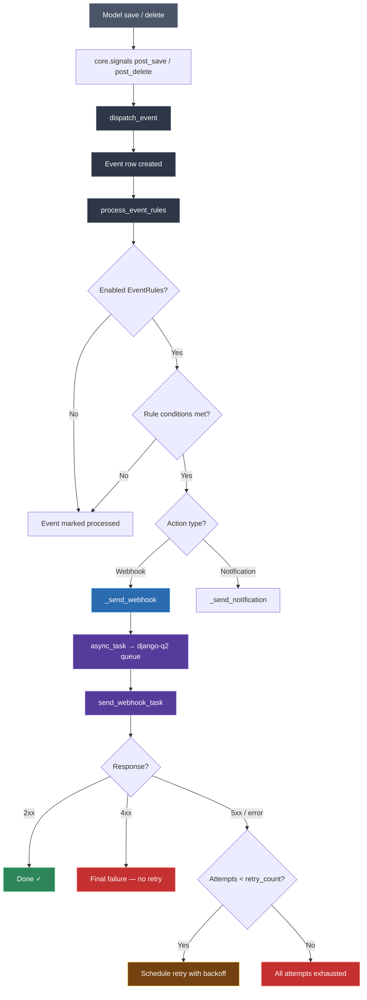

# Webhooks & Automation — how they work

ITAMbox can push real-time event notifications to external systems through
**Webhook Endpoints** and **Event Rules**. Together they let you trigger
automations in Slack, Teams, CI/CD pipelines, custom integrations, or any
HTTP-speaking service whenever an asset, license, contract, or other tracked
object is created, updated, or deleted.

> **Disclaimer:** Webhook delivery is asynchronous — events are enqueued via
> `django-q2` and dispatched by background workers. The worst-case delay is
> the time it takes the next worker cycle to pick up the task. For instant
> delivery keep your worker pool responsive and monitor the task queue.

---

## Architecture overview



The pipeline lives in `core/events.py` (event dispatch and rule matching),
`core/tasks/webhooks.py` (outbound HTTP delivery + retry logic), and
`extras/models.py` (the `WebhookEndpoint` and `EventRule` models).

---

## Webhook Endpoints

A **Webhook Endpoint** defines *where* and *how* ITAMbox sends HTTP payloads.
It is the reusable, connection-level configuration — URL, authentication
headers, HTTP method, signing secret, and retry policy.

### Creating a webhook endpoint

1. Navigate to **Extras → Webhook Endpoints** and click **Add**.
2. Fill in the form:

| Field | Required | Description |
|---|---|---|
| **Name** | Yes | Unique identifier, e.g. `Slack #it-alerts` or `Zapier Asset Sync` |
| **URL** | Yes | The destination URL. Must be a public, external URL — internal/private addresses are blocked by the SSRF guard. |
| **HTTP Method** | Yes | `POST` (default), `PUT`, `PATCH`, or `GET` |
| **Enabled** | — | Toggle to temporarily pause deliveries without deleting the endpoint |
| **Secret** | No | Shared secret for HMAC-SHA256 payload signing (see [HMAC signature verification](#hmac-signature-verification)) |
| **Payload Preset** | No | Pre-fill the payload with Slack Block Kit or Teams Adaptive Card templates |
| **Headers** | No | JSON object of custom HTTP headers (e.g. `{"Authorization": "Bearer xxx"}`) |
| **Retry Count** | No | Maximum retry attempts on delivery failure (default: `3`) |
| **Retry Backoff** | No | Seconds to wait between retries (default: `60`) |
| **Tenant** | Admin only | Scope the endpoint to a specific tenant, or leave blank for system-wide |

!!! warning "SSRF Protection"
    The URL is validated at **save time** and again at **send time**.
    Loopback addresses (`127.0.0.1`, `localhost`), link-local IPs, private
    ranges (`10.0.0.0/8`, `172.16.0.0/12`, `192.168.0.0/16`), and cloud
    metadata endpoints are **rejected outright**. This is fail-closed: a
    blocked URL is never retried.

### Enabling and disabling an endpoint

Toggle the **Enabled** checkbox on the endpoint form. When disabled:

- Existing Event Rules that reference this endpoint **will not fire** — the
  `_send_webhook` function checks `endpoint.enabled` and returns immediately.
- The endpoint stays in your list and all configuration is preserved.
- Re-enabling it resumes delivery for all linked rules immediately.

Use this to temporarily silence a broken integration without unlinking rules.

### Retry logic

When a webhook delivery fails, the system retries according to the endpoint's
retry policy:

| Scenario | Behaviour |
|---|---|
| **2xx response** | Success — done. |
| **4xx response** (400–499) | **Final failure.** Client errors (bad request, auth failure, not found) are never retried — fix the payload or credentials and re-send manually. |
| **5xx response** (500–599) | Retried up to `retry_count` times, with `retry_backoff` seconds between each attempt. |
| **Connection error** (DNS, timeout, TLS) | Same as 5xx — retried. |
| **SSRF guard rejection** | **Final failure** — blocked URLs are never retried. |

Retries use a one-shot `django-q2` `Schedule` row set to `next_run = now +
retry_backoff`, so the backoff is honoured even if the worker pool is busy.

> [!IMPORTANT]
> The `secret` field is stored encrypted at rest (`enc$...` ciphertext) and is
> **never** written to the django-q2 payload or the retry `Schedule.kwargs`
> (which are stored plaintext). Endpoint-linked webhooks re-derive the secret
> from the database on each delivery attempt. Legacy webhooks that don't link
> to an endpoint store their secret in the rule config and are not protected
> this way — migrate them to endpoints.

### Testing a webhook endpoint

There is no built-in "send test" button in the current release. To verify a
webhook endpoint:

1. Create a temporary **Event Rule** linked to the endpoint, targeting a
   low-traffic model (e.g. `Tag`) and listening for the `create` event.
2. Create a test object — the webhook fires.
3. Check the `django-q2` worker logs for delivery status:
   ```
   Webhook sent to https://example.com/hook — status 200
   ```
   or
   ```
   Webhook https://example.com/hook returned 403 — not retrying (4xx is final)
   ```
4. Delete the test rule and test object.

---

## Event Rules

An **Event Rule** defines *when* a webhook fires. It watches a Django model
(e.g. `Asset`, `License`, `Contract`) for lifecycle events (`create`, `update`,
`delete`, `restore`) and triggers an action — either a webhook or an in-app
notification.

### Creating an event rule

1. Navigate to **Extras → Event Rules** and click **Add**.
2. Fill in the form:

| Field | Required | Description |
|---|---|---|
| **Name** | Yes | Descriptive name, e.g. `Asset Created → Teams` |
| **Model** | Yes | The Django model to watch. Only models that emit events are listed (anything inheriting `ChangeLoggingMixin`). |
| **Events** | Yes | JSON list of event types: `["create"]`, `["create", "update"]`, `["delete"]`, `["restore"]` |
| **Action Type** | Yes | `Webhook` (calls an endpoint) or `Notification` (in-app alert) |
| **Webhook** | Cond. | The Webhook Endpoint to call. Required when action type is `Webhook`. |
| **Conditions** | No | Optional JSON filter rules to narrow when the rule fires (see below) |
| **Action Config** | No | Advanced JSON overrides — custom headers, payload templates |
| **Enabled** | — | Toggle to temporarily pause the rule |
| **Tenant** | Admin only | Scope the rule to events from a specific tenant, or leave blank for system-wide |

> [!IMPORTANT]
> When the action type is `Webhook`, the `Webhook` field takes precedence over
> any `url` in `action_config`. If the linked endpoint is disabled, the rule
> silently skips firing. Always link to an endpoint — it gives you secret
> encryption, retry policy, and a single place to manage the connection.

### Conditions

The `Conditions` field accepts a JSON object that filters events. The condition
engine supports:

| Operator | Description | Example |
|---|---|---|
| `eq` | Equal | `{"field": "status", "op": "eq", "value": "active"}` |
| `neq` | Not equal | `{"field": "status", "op": "neq", "value": "draft"}` |
| `gt` | Greater than | `{"field": "data.purchase_cost", "op": "gt", "value": 5000}` |
| `lt` | Less than | `{"field": "data.purchase_cost", "op": "lt", "value": 1000}` |

Conditions are matched against `event.data` — the serialized snapshot of the
object at the time the event was created. Combine multiple conditions with
`"type": "and"` or `"type": "or"` at the top level:

```json
{
    "type": "and",
    "rules": [
        {"field": "status", "op": "eq", "value": "retired"},
        {"field": "data.purchase_cost", "op": "gt", "value": 5000}
    ]
}
```

### Event types

| Event | Emitted when |
|---|---|
| `create` | A new object is saved for the first time |
| `update` | An existing object is saved (any field change) |
| `delete` | An object is soft-deleted (`deleted_at` set) |
| `restore` | A soft-deleted object is restored (`deleted_at` cleared) |

> **Note:** Internal operational models (`Event`, `ObjectChange`,
> `JournalEntry`, `Notification`, `Job`, `ReportGenerationArchive`) are
> excluded from event dispatch to prevent infinite recursion. You cannot
> create event rules that watch these models.

### Tenant scoping

Event rules are tenant-aware. A rule with `tenant = "Acme Corp"` only fires
for events on objects belonging to *that tenant*. A rule with `tenant = None`
(global/system-wide) fires for objects from *any* tenant. This lets you:

- Create per-tenant webhooks (e.g. a Slack channel per customer).
- Create global rules that apply everywhere (e.g. a security audit webhook
  that fires on any tenant's `User` changes).

The tenant check uses the object's **own** tenant (resolved via
`_resolve_instance_tenant_id`), not the ambient tenant context — so a
management command or worker task won't accidentally cross-tenant-dispatch.

---

## HMAC signature verification

When you set a **Secret** on a Webhook Endpoint, every non-Slack/non-Teams
outbound payload includes an `X-Hub-Signature-256` header so your receiver can
verify that the payload originated from ITAMbox and was not tampered with.

### How ITAMbox signs the payload

The signature is an **HMAC-SHA256** hex digest of the JSON request body,
computed with the shared secret:

```python
import hmac, hashlib

signature = hmac.new(
    secret.encode('utf-8'),
    json_body.encode('utf-8'),
    hashlib.sha256,
).hexdigest()
```

The header is set as:

```
X-Hub-Signature-256: sha256=<hex_digest>
```

### How to verify on your receiver

```python
import hmac, hashlib

def verify_signature(request_body: bytes, signature_header: str, secret: str) -> bool:
    """Verify an ITAMbox webhook payload. Returns True if valid."""
    if not signature_header:
        return False
    # Header format: "sha256=<hex>"
    try:
        algo, received_sig = signature_header.split('=', 1)
        if algo != 'sha256':
            return False
    except ValueError:
        return False

    expected_sig = hmac.new(
        secret.encode('utf-8'),
        request_body,  # raw bytes, not decoded
        hashlib.sha256,
    ).hexdigest()

    return hmac.compare_digest(expected_sig, received_sig)
```

> [!IMPORTANT]
> Always use `hmac.compare_digest()` (or equivalent constant-time comparison)
> instead of `==` — it prevents timing attacks that can leak the expected
> signature byte by byte.

### Payload format

A standard webhook payload (non-Slack, non-Teams) looks like:

```json
{
    "event": "create",
    "model": "assets.asset",
    "object_id": 42,
    "timestamp": "2026-07-20T14:30:00+00:00",
    "data": {
        "app_label": "assets",
        "model_name": "asset"
    }
}
```

| Field | Description |
|---|---|
| `event` | The event action — `create`, `update`, `delete`, or `restore` |
| `model` | Fully-qualified Django model reference (`<app_label>.<model_name>`) |
| `object_id` | The primary key of the affected object |
| `timestamp` | ISO 8601 timestamp of when the event was created |
| `data` | The `event.data` JSON blob (includes at minimum `app_label` and `model_name`) |

Slack and Teams webhooks use platform-specific payloads (Slack Block Kit /
Teams Adaptive Card) and do **not** include the HMAC signature header — those
platforms handle authentication through their own webhook URL tokens.

---

## Troubleshooting

**Webhooks are not firing at all**

: Check that:
  - The Webhook Endpoint is **enabled** (`enabled = true`).
  - The Event Rule is **enabled**.
  - The rule's `Events` list includes the event type you're expecting
    (`create`, `update`, `delete`, `restore`).
  - The rule's `Model` matches the object you're modifying.
  - The object actually emits events (internal models like `Event` and
    `ObjectChange` are excluded).
  - The `django-q2` cluster is running and processing tasks.

**I see events in the database but no HTTP call was attempted**

: Verify that `django-q2` workers are running (`manage.py qcluster`). The
  webhook task is enqueued via `async_task` and dispatched asynchronously.
  Check the worker logs for task pickup.

**Delivery fails with a 4xx status**

: 4xx errors are **final** — the system does not retry them. Common causes:
  - `401` / `403`: The `Authorization` header or webhook URL token is invalid.
  - `404`: The destination URL is wrong or the endpoint was deleted.
  - `400`: The payload format doesn't match the receiver's expectations.

  Fix the configuration and trigger a new event to re-send.

**Delivery fails with a 5xx status or connection error**

: The system retries up to `retry_count` times with `retry_backoff` seconds
  between attempts. Check:
  - The destination server is reachable from the ITAMbox host.
  - DNS resolves correctly from the worker container/server.
  - The URL passes the SSRF guard (no private/internal addresses).
  - After `retry_count` attempts the task is abandoned — check the worker logs
    for the final error message.

**How do I check delivery status?**

: There is no persistent delivery log table in the current release. Check the
  `django-q2` worker logs for per-delivery status messages:
  ```
  INFO  Webhook sent to https://hooks.example.com/webhook — status 200
  WARN  Webhook https://hooks.example.com/webhook returned 403 — not retrying (4xx is final)
  WARN  Webhook https://hooks.example.com/webhook failed (attempt 2/3): ... — retrying in 60s
  ERROR Webhook https://hooks.example.com/webhook: all 3 attempts failed: ...
  ERROR Webhook https://hooks.example.com/webhook blocked by SSRF guard: ...
  ```
  For long-term monitoring, pipe these logs to your observability stack
  (ELK, Grafana Loki, CloudWatch, etc.) or set up log-based alerts on
  `ERROR`-level webhook log lines.

**The HMAC signature doesn't match on my receiver**

: Common pitfalls:
  - You're comparing the raw body bytes (correct) against a decoded string
    (incorrect) — always sign the **raw request body bytes**.
  - The `secret` on the endpoint doesn't match the one in your verification
    code — copy it exactly.
  - Extra whitespace or encoding changes in transit (e.g. a proxy normalising
    the JSON). Log the raw body bytes on your receiver and compare.
  - Use `hmac.compare_digest()`, not `==`, to avoid timing side-channels.

**My event rule fires on every update, not just the field I care about**

: Add a `conditions` filter to narrow the rule. For example, to fire only
  when an asset's `status` changes to `retired`:
  ```json
  {"field": "status", "op": "eq", "value": "retired"}
  ```
  The condition is evaluated against `event.data`, which holds the
  serialized object state at the time the event was created.

**Webhook URL is rejected by the SSRF guard**

: The URL targets a private, internal, or loopback address. Use a public
  URL. If you need to send webhooks to an internal service, use a reverse
  proxy or a publicly-routable DNS name that resolves to the internal host.

**Slack / Teams payload looks wrong or is missing fields**

: Slack and Teams webhooks use fixed-format payloads that are deliberately
  simple. For richer payloads, target a **generic webhook** (any URL not
  matching `hooks.slack.com` or `*.office.com/webhook`) and use the
  `action_config` field on the Event Rule to customise the template.
